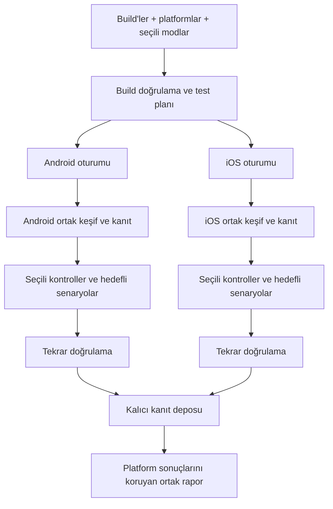
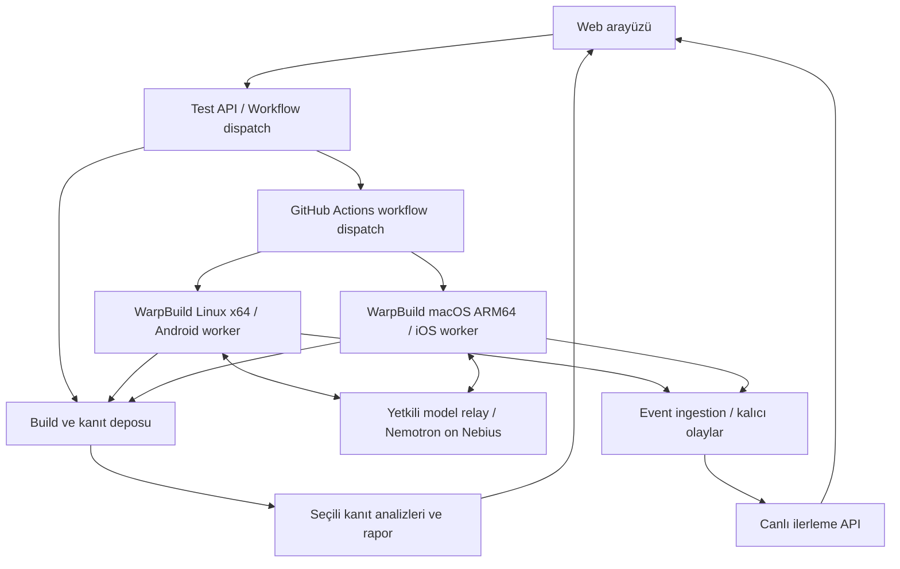

# Otonom Mobil QA — Ürün Kapsamı ve Çalışma Akışı

Tarih: 2 Ekim 2026  
Durum: Tartışma taslağı. Bu belge ürün gereksinimlerini ve önerilen tasarımı tanımlar; çalışan entegrasyon veya tamamlanmış özellik beyanı değildir.

## 1. Kullanıcının belirlediği kapsam

- Android ve iOS ilk ürün kapsamında yer alacak.
- Hosted test altyapısı için WarpBuild kullanılacak.
- Kullanıcı APK ve/veya iOS uygulama build'i yükleyebilecek.
- Kullanıcı tek bir test modunu veya birden fazla modu birlikte seçebilecek.
- Web arayüzünde testin ilerleyişi, yapılan eylemler ve ekran kesitleri görülebilecek.
- Test sonunda kanıtlar ve tekrar üretim adımları içeren rapor sunulacak.
- Geliştirme sırasında kapsamlı AI desteği ve paralel kod üretimi kullanılacak.

Ürünün vaadi: Kullanıcı test senaryoları yazmadan uygulamasını test etmeye başlayabilir. Özel erişim gerektiren uygulamalar için test hesabı, OTP yöntemi veya test verisi sağlanması gerekebilir.

## 2. Build kabul sözleşmesi

| Platform | Başlangıç girdisi | Kabul kontrolü |
|---|---|---|
| Android | APK | Android sürümü, paket bilgisi, varsa native ABI uyumu ve kurulum/açılış testi |
| iOS | ZIP içinde iOS Simulator için derlenmiş ARM64 `.app` | Simulator platform hedefi, executable/framework mimarileri, minimum OS ve kurulum/açılış testi |

WarpBuild'in macOS runner'ları ARM64 olduğundan iOS build'i buna uygun olmalı. ARM64 fiziksel iPhone build'i ve ARM64 Simulator build'i farklı platform hedefleridir; `.ipa` içinden `.app` çıkarmak dönüştürme işlemi değildir. [WarpBuild runner dokümanı](https://www.warpbuild.com/docs/ci/cloud-runners), [Apple TN3117](https://developer.apple.com/documentation/technotes/tn3117-resolving-build-errors-for-apple-silicon).

Android APK içinde native kütüphane varsa emulator ABI'si ile eşleşmesi kontrol edilir. Başlangıçta x86_64 içeren uygun APK desteği öngörülebilir bir sözleşmedir; ARM-only APK desteği ayrıca doğrulanacaktır. [Android ABI dokümanı](https://developer.android.com/ndk/guides/abis).

Uyumsuz build, uygulama hatası olarak sayılmaz. Ürün kullanıcıya build'in neden kabul edilemediğini açıklar. İki build'in aynı mantıksal uygulamaya ait olduğunu kullanıcı belirtir; sürüm bilgileri her oturumda ayrı saklanır.

## 3. Birleştirilebilir test modları

| Mod | Amaç | Örnek kontroller | Sonucun dayanağı |
|---|---|---|---|
| Functional / User Flows | Keşfedilen normal kullanım akışlarını denemek | Giriş, profil düzenleme, kaydetme, yeniden açma | Eylem öncesi/sonrası durum ve tekrar testi |
| Bug / Stress Testing | Akışları kontrollü koşullarda zorlamak | Boş/uzun giriş, hızlı tekrar, lifecycle, desteklenen ağ/izin senaryoları | Gözlenen başarısızlık, log ve tekrar oranı |
| UI / UX | Görsel ve kullanım problemlerini araştırmak | Klavye altında kalan eylem, clipping, hizalama, tutarlılık | İşaretlenmiş görüntü; ölçüm veya AI yorumu ayrımı |
| Accessibility | Desteklenen erişilebilirlik kontrollerini yapmak | Etiketler, metin ölçeği, platform audit'leri | Kullanılan aracın çıktısı ve değerlendirme kapsamı |
| Store Readiness | Seçili platform kurallarına ilişkin riskleri araştırmak | Hesap/gizlilik akışları, erişilebilir bağlantılar, eksik bilgiler | Kural referansı, gözlem ve gerekli ek bilgi |

`Full Autonomous Test`, desteklenen modları seçen bir ön ayardır. Modlar farklı hedefler ve analizler tanımlar. UI/UX tek başına seçilse bile ilgili ekranlara ulaşmak için keşif ve etkileşim gerekir.

Performans/animasyon ölçümlerinin ilk sürümdeki kapsamı açık karardır. Video gözleminden doğan yavaşlık şüphesi, ölçülmüş frame-drop metriği olarak sunulmaz.

## 4. Ortak keşif ve platform oturumları

Bir test koşusu (`TestRun`) platform başına ayrı oturumlar (`PlatformSession`) içerir. Başlangıçta bir Android ve bir iOS cihaz profili hedeflenir. Üç mod ve iki platform seçmek, mod başına ayrı runner gerektirmez. Cihaz matrisi genişletildiğinde ek oturumlar oluşturulur.

Her platform kendi ekran/durum grafiğini çıkarır. Platformlar arasında “profili düzenle” gibi anlamsal hedefler paylaşılabilir; koordinatlar, locator'lar ve kanıtlar platforma özgüdür.

Bir cihazı aynı anda tek eylem kontrolcüsü yönetir. Görsel, erişilebilirlik ve readiness analizleri yeni gözlemler üzerinde paralel yürüyebilir. Bu analizlerin ihtiyaç duyduğu ek etkileşimler sıraya alınır.

Stress testleri temiz başlangıçtan ayrı dallarda yürür. Uygulama/simulator sıfırlamak backend verisini sıfırlamaz; hesap ve test verisi oturumlara göre ayrılmalıdır. Baseline ekranlar ile hata koşullarındaki ekranlar ayrı bağlamla kaydedilir.

Her test için platform/OS/araç yetenekleri kontrol edilir. Örneğin Appium'ın iOS `enableConditionInducer` işlemi gerçek cihazlarla sınırlıdır; simulator ağ senaryosu ayrı bir adaptörle doğrulanmalıdır. XCUITest erişilebilirlik audit'i ise sürüm koşullarına bağlı olarak kullanılabilir. [Appium XCUITest execute methods](https://appium.github.io/appium-xcuitest-driver/latest/reference/execute-methods/).

## 5. WarpBuild ile önerilen altyapı

WarpBuild, GitHub Actions uyumlu ephemeral runner sağlar. Önerilen başlatma yolu: ürün backend'i bizim runner workflow'umuzu `workflow_dispatch` ile tetikler. Kullanıcının APK yüklemek için kendi GitHub deposunu bağlaması gerekmez. [WarpBuild çalışma modeli](https://www.warpbuild.com/docs/ci/what-is-warpbuild), [GitHub workflow dispatch API](https://docs.github.com/en/rest/actions/workflows#create-a-workflow-dispatch-event).

- Android job: Linux x64, Android Emulator, KVM ve Android otomasyon adaptörü. KVM için WarpBuild dynamic label ve gerekli izin adımı kullanılmalıdır. [WarpBuild nested virtualization](https://www.warpbuild.com/docs/ci/features/nested-virtualization).
- iOS job: macOS ARM64, Xcode/iOS Simulator ve iOS otomasyon adaptörü.
- Otomasyon adayı: Android'de Appium UiAutomator2, iOS'ta Appium XCUITest. Sürümler pinlenerek küçük örnek build'lerle entegrasyon doğrulanacaktır.
- Agent döngüsü platform runner'ının içinde çalışır; model çağrıları yetkili API relay'i üzerinden Nebius Token Factory'ye gider. Kanıtlar cihaz runner'ı kapanmadan kalıcı depoya yüklenir. Son birleşik raporlama ayrı kısa Linux job'unda devam eder. Vercel Pro ve Supabase Pro (veritabanı, Auth, Realtime ve Storage) tercihleri [mimari belgesinde](02-architecture.md) tanımlanmıştır.

Başlangıçta modlar aynı runner'ı paylaşır; platform oturumları kapasite uygunsa paralel çalışır. macOS eşzamanlılık kapasitesi kurulumda doğrulanacaktır. İptal, timeout ve altyapı hatalarında oturum durumu ve yüklenmiş kısmi kanıt korunur. Oturum başına kısa ömürlü yetki kullanılması ve job heartbeat'i önerilir.

## 6. Web arayüzünde canlı izleme

İlk sürüm canlı olay akışı ve adımlara bağlı ekran kesitleri sunar. Runner olayları HTTPS ile backend'e, kanıtları imzalı yetkiyle Supabase Storage'a gönderir. Backend'in Supabase'e kaydettiği olaylar Supabase Realtime üzerinden web arayüzüne bildirilir; bağlantı sonrası kaçırılan olaylar kalıcı kayıtlardan okunur. Tam video yayını bağımsız bir sonraki iyileştirme olabilir.

Görünür içerikler:

- Android/iOS oturumlarının kendi fazları: hazırlanıyor, keşfediyor, test ediyor, doğruluyor, raporluyor.
- Yapılan eylem, gözlenen sonuç ve ilgili screenshot.
- Keşfedilen ekran/durum sayısı ve işlenen eylemler.
- Bulgu adayı, tekrar doğrulaması ve varsa erişim/altyapı engeli.
- Testi iptal etme ve oturumlar arasında geçiş.

Olay sözleşmesi önerisi: `runId`, `sessionId`, `platform`, `stepId`, monoton `sequence`, zaman, faz, eylem/sonuç ve artifact referansları. Bağlantı yeniden kurulduğunda son olaydan devam edilebilir. Bilinmeyen uygulama kapsamı için yanıltıcı “%100 test coverage” gösterilmez; süre bütçesi ve gözlenen keşif sayıları gösterilir.

Ağ kesme senaryosu worker'ın kontrol servisiyle iletişimini korumalıdır. Timeline, yapılan gözlemleri ve karar özetlerini gösterir; modelin iç muhakemesini gösterme gereksinimi yoktur.

## 7. Rapor ve sonuçların anlamı

Tek raporda platform filtreleri, mod kategorileri ve bağımsız platform kanıtları bulunur. Benzer sorunlar ilişkilendirilebilir; Android bulgusu iOS için doğrulanmış sayılmaz.

Her bulgu: build kimliği/hash, platform/OS/cihaz profili, test koşulları, beklenen davranışın dayanağı, gözlenen sonuç, tekrar üretim adımları, gerçekten yapılan tekrar oranı, severity gerekçesi, screenshot/video/log referansları ve replay tanımı.

| Alan | Önerilen durumlar |
|---|---|
| Oturum | Queued, Preparing, Exploring, Testing, Reproducing, Reporting, Completed, Cancelled, Blocked, Infrastructure Failed |
| Genel koşu | Running, Completed, Partial, Cancelled, Infrastructure Failed |
| Kontrol | Passed within tested scope, Failed, Inconclusive, Not tested, Unsupported |
| Bulgu | Observed, Reproduced n/m, Potential issue, Manual review required |
| Store kontrolü | Evidence found, Potential risk, Needs additional information, Not applicable, Not assessed |

`Completed`, planın yürütülmesinin sona erdiğini belirtir. `Unsupported`, kontrolün ortamda desteklenmediğini belirtir; uygulama hatası değildir. Bir platform tamamlanırken diğerinin engellenmesi kısmi sonuç olarak görünür.

Store Readiness seçili kontrolleri ve eksik bilgileri raporlar. Binary/runtime; store metadata, gizlilik beyanlarının doğruluğu ve bütün backend davranışlarını tek başına doğrulayamaz. Apple başvuru koşulları metadata ve review erişimi gibi uygulama dışında bilgiler de ister. Google da veri beyanları ve kapsama giren uygulamalarda hesap silme yolları ister. [Apple App Review Guidelines](https://developer.apple.com/app-store/review/guidelines/), [Google User Data](https://support.google.com/googleplay/android-developer/answer/10144311), [Google account deletion](https://support.google.com/googleplay/android-developer/answer/13327111).

Bir akış keşfedilemediyse sonuç “keşfedilemedi” olmalıdır. Store onayı garantisi verilmez. iOS runtime kanıtının ortamı açıkça iOS Simulator olarak yazılır.

## 8. İlk teknik doğrulama ve açık kararlar

İlk entegrasyon denemesi, örnek APK ve ARM64 Simulator `.app` üzerinde iki WarpBuild job'unu başlatıp uygulamayı açma, bir eylem yapma, screenshot/log'u test devam ederken web arayüzüne ulaştırma ve job'u kapatma zincirini doğrulamalıdır. Sonraki adımlar ortak keşif, mod stratejileri ve tekrar doğrulamadır.

Henüz seçilmemiş kararlar:

- Web/API/queue/database/object storage ve hosting tercihleri [mimari belgesinde](02-architecture.md) belirlenmiştir; gerçek entegrasyonları pilotla doğrulanacaktır.
- Nemotron planlama modeli ve görsel model; API erişimi, latency ve gerçek UI başarısı.
- İlk Android/iOS sürümleri, cihaz profilleri ve desteklenen APK ABI'leri.
- Mod başına ilk somut kontroller ve desteklenmeyen işlemlerin matrisi.
- Başlangıç test süresi, ekran kesiti sıklığı, kanıt saklama süresi ve runner concurrency.
- Self-hosted runner bağlantısı, geniş cihaz matrisi ve repo-to-build yol haritası.

Belgedeki altyapı ve araç ayrıntıları 2 Ekim 2026'da resmî kaynaklarla araştırılmıştır. WarpBuild üzerinde gerçek pilot çalıştırma henüz yapılmamıştır.
