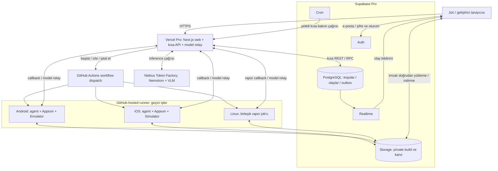
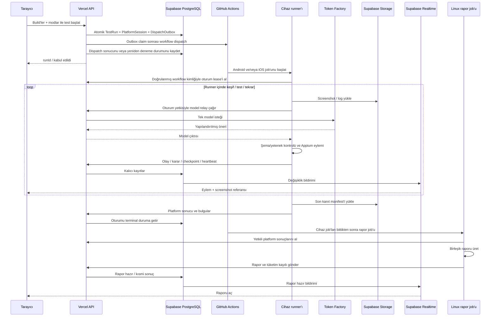

# Otonom Mobil QA — Sistem Mimarisi ve Maliyet

Tarih: 3 Ekim 2026  
Durum: Kullanıcının onayladığı Vercel Pro + Supabase Pro planına göre mimari tasarım. Kaynaklar ve fiyatlar araştırılmıştır; abonelikler bu çalışma kapsamında satın alınmamış, servisler kurulmamış ve gerçek pilot çalıştırılmamıştır.

Bu belge [ürün kapsamını](01-product-scope-draft.md) teknik bileşenlere, veri akışına ve hesaplanabilir bir bütçeye dönüştürür. Agent stratejileri ve başlangıç bütçeleri [agent ve test tasarımında](03-agent-and-test-design.md), kurulum ve jüri teslimi [teslim ve operasyon belgesinde](04-delivery-and-operations.md) tanımlanır. Maliyet için ayrı bir dosya oluşturulmaz.

## 1. Temel kararlar

İlk sürüm, önceden oluşturulmuş hesaplarla erişilen bir jüri demosudur. Jüri örnek Android/iOS build'leriyle yeni test başlatabilir, uygun kendi build'ini yükleyebilir, ilerlemeyi izleyebilir ve tamamlanmış örnek raporu inceleyebilir. Genel kullanıcı kaydı ve ödeme sistemi bu sürümün kapsamında değildir.

| Katman | Teknoloji | Görevi |
|---|---|---|
| Web ve hosting | Next.js App Router + TypeScript, Vercel Pro | Giriş, yükleme, mod seçimi, canlı izleme ve rapor |
| Arayüz | Tailwind CSS + shadcn/ui | Dashboard ve ortak bileşenler |
| Kimlik doğrulama | Supabase Auth, e-posta/şifre | Önceden oluşturulmuş jüri ve geliştirici hesapları |
| HTTP API | Next.js Route Handlers, Node runtime | Kısa kullanıcı işlemleri, dispatch, model relay ve callback |
| Veritabanı | Supabase Pro, tek Micro PostgreSQL projesi | Koşular, olaylar, grafikler, bulgular, raporlar ve tüketim |
| Kalıcı iş durumu | PostgreSQL outbox + atomik claim/lease | Dispatch ve yeniden denemelerin kalıcı takibi |
| Durum uzlaştırma | Supabase Cron → kısa Vercel API işlemi | Bekleyen dispatch, heartbeat, sağlayıcı sonucu ve rapor retry |
| Dosyalar | Supabase Storage (Pro), private bucket'lar | Build, screenshot, video, log ve rapor çıktıları |
| Test ve agent | GitHub-hosted runner içindeki Node.js/TypeScript agent | Keşif/plan/eylem döngüsü ve mobil test |
| Mobil otomasyon | Appium + WebdriverIO | Android UiAutomator2 / iOS XCUITest adaptörleri |
| Son raporlama | Kısa GitHub-hosted Linux job'u | Platform sonuçlarından birleşik rapor üretimi |
| AI | Nebius Token Factory, Vercel üzerinden yetkili relay | NVIDIA Nemotron planlama ve ayrı görsel model |
| Canlı ilerleme | Supabase Realtime + kalıcı RunEvent kayıtları | Olay ve screenshot referanslarının tarayıcıya aktarımı |

Uzun test döngüsü GitHub Actions runner'larında çalışır. Vercel kısa kontrol işlemlerini, Supabase kalıcı durum ve kullanıcı erişimini sağlar. Agent ve birleşik raporlama kaynakları yalnız ilgili job boyunca ayrılır. **8 Ekim 2026 kararı:** WarpBuild kişisel GitHub hesaplarını desteklemediği için V1, public repoda ücretsiz ve sınırsız olan GitHub-hosted standart runner'ları kullanır. Runner etiketi workflow ayarıdır; WarpBuild (GitHub organization gerektirir) veya larger runner'lara geçiş yalnız bu ayarı ve §9.3 maliyetini değiştirir.

Pro abonelikleri kullanılacaktır; ücretsiz plan limitleri temel mimarinin varsayımı değildir. **8 Ekim 2026 kararı:** Dosya deposu Cloudflare R2 yerine Supabase Storage'dır. Sağlayıcı, anahtar ve CORS yönetimi azalır. Dosya erişimi aynı Supabase projesinde yetkilendirilir. Pro hakları (100 GB depolama, 250 GB uncached + 250 GB cached egress, dosya başına 500 GB'a kadar) V1 hacminin üstündedir. R2'nin ücretsiz egress avantajı bu hacimde belirleyici değildir. Dosya işlemleri küçük bir depolama adaptörünün arkasında tutulur; gerekirse R2'ye dönüş tek adaptör değişikliğidir. Aynı build/kanıt iki depoda tutulmaz.

## 2. Üst düzey mimari



Vercel production deployment ve Supabase projesi başlangıçta Avrupa bölgesinde seçilir; mümkün olduğunda birbirine yakın konumlandırılır. Token Factory adayları `eu-north1` endpoint'leridir. Gerçek bölgeler, araç ve model sürümleri her koşuda kaydedilir.

Supabase yönetilen PostgreSQL'dir. Vercel API başlangıçta Supabase REST/RPC kullanır; çok adımlı atomik işlemler SQL fonksiyonlarıyla yapılır. Doğrudan SQL istemcisi gerekirse serverless bağlantılar için uygun transaction pooler seçilir; prepared statement ve bağlantı sayısı koşulları doğrulanır. [Supabase bağlantı seçenekleri](https://supabase.com/docs/guides/database/connecting-to-postgres).

## 3. Jüri erişimi ve build yükleme

Supabase Auth ile e-posta/şifre girişi kullanılır; yeni kullanıcı kaydı provider ayarından kapatılır. Jüri hesapları güvenilir server/admin bootstrap işlemiyle oluşturulur. Hazır hesaplarda e-posta onayı yönetici tarafından ayarlanabilir; jüri girişini mail gönderimine bağımlı hale getirmeyiz. [Auth yapılandırması](https://supabase.com/docs/guides/auth/general-configuration), [admin.createUser](https://supabase.com/docs/reference/javascript/auth-admin-createuser).

Next.js server/client entegrasyonu Supabase SSR istemcileriyle yapılır. API, istekteki kullanıcı kimliğini doğrular ve ilgili koşuya erişimi kontrol eder. PostgreSQL tablolarında RLS uygulanır: kullanıcı kendi koşularına ve izinli paylaşılan örneklere erişebilir. Realtime filtresi yetkilendirmenin yerine geçmez. [Supabase SSR](https://supabase.com/docs/guides/auth/server-side/nextjs).

Yükleme akışı:

1. API, platform/dosya metadatasıyla `AppBuild` kaydı oluşturur ve belirli Storage nesne yolu için imzalı yükleme yetkisi (`createSignedUploadUrl`) üretir.
2. Tarayıcı dosyayı doğrudan private `builds` bucket'ına yükler; 6 MB üzeri dosyalarda aynı imzalı token ile resumable (TUS) yükleme kullanılır. APK veya ZIP, Vercel request body'sinden geçirilmez.
3. API nesnenin varlığını/boyutunu kontrol eder ve build'i teste hazır doğrulama bekleyen duruma getirir.
4. Runner binary'yi indirir, hash ve gerçek platform bilgisini kaydeder; ZIP yolu kaçışı, aşırı açılmış boyut, ABI/OS uyumsuzluğu ve kurulum hatasını kontrol eder.
5. Uyumsuz build açıklamalı giriş hatasıdır; uygulama bug'ı olarak sayılmaz.

İmzalı URL'ler tek nesne yoluna bağlıdır. Supabase imzalı yükleme URL'si 2 saat geçerlidir ve bu süre değiştirilemez. Resumable yükleme oturumu en çok 24 saat sürer. İndirme URL'leri (`createSignedUrl`) kısa süreyle üretilir. Bucket'ların boyut ve MIME sınırları bucket ayarında tanımlanır. Bütün imzalar yalnız server'daki secret key ile üretilir; Storage tablolarında tarayıcıya açık politika yoktur. Büyük binary Vercel'den geçirilmediği için function payload sınırına takılmaz. [Signed upload URL](https://supabase.com/docs/reference/javascript/storage-from-createsigneduploadurl), [Resumable uploads](https://supabase.com/docs/guides/storage/uploads/resumable-uploads), [Dosya sınırları](https://supabase.com/docs/guides/storage/uploads/file-limits), [Vercel function sınırları](https://vercel.com/docs/functions/limitations).

Android girdisi APK; ilk emulator profili Linux x64 ile uyumlu native ABI gerektirir. iOS girdisi ZIP içinde ARM64 **iOS Simulator** `.app` paketidir. Fiziksel iPhone ARM64 build'i simulator build'iyle eşdeğer değildir. Tam kabul sözleşmesi ürün kapsamı belgesindedir.

Örnek uygulama iki platformda karşılaştırılabilir akışlar ve açıkça belirtilen örnek hatalar içerir. Her koşu kendi test hesabı/veri alanını kullanır. Simulator'ı sıfırlamak uzaktaki uygulama backend verisini sıfırlamaz.

## 4. Testin yürütülmesi

Bir `TestRun`, platform başına bir `PlatformSession` içerir. Android+iOS ve üç mod seçildiğinde iki cihaz job'u açılır. Modlar aynı oturumun keşfini ve kanıtlarını paylaşır; ek etkileşimler platformun tek eylem sırasına girer.

Run başına bir GitHub workflow'u tetiklenir. Workflow seçili Android/iOS job'larını çalıştırır; bu işler terminal duruma geldikten sonra `always() && !cancelled()` koşullu bir Linux rapor job'u kısmi veya tam rapor üretir. Kullanıcı iptali GitHub workflow'una da iletilir; rapor dispatch/bootstrap işlemleri DB iptal durumunu ayrıca kontrol eder. API dispatch kabulünü testin tamamlanması olarak yorumlamaz.



Agent'ın hedefleri, planlama geçmişi ve Observe → Plan → Act → Evaluate döngüsü runner'da yürür. Vercel model relay'i her istekte tek model çağrısı yapar; keşif döngüsünü veya uzun işi barındırmaz. Böylece Token Factory anahtarı runner'a verilmeden agent geçici test ortamında çalışabilir.

Runner, Appium portunu internete açmadan HTTPS ile API'ye bağlanır. Görsel/erişilebilirlik değerlendirmeleri ortak kanıtı kullanır; bir cihaz üzerinde aynı anda tek eylem uygulanır. Platform bulguları runner kapanmadan kalıcılaştırılır.

### Runner profilleri ve rapor job'u

| İş | Başlangıç runner adayı | Gereken ortam |
|---|---|---|
| Android | `ubuntu-24.04` x64, 4 vCPU / 16 GB | KVM, x64 Android Emulator (API 35), Appium UiAutomator2 |
| iOS | `macos-26` ARM64 (M1), 3 vCPU / 7 GB | Xcode 26.6, iOS 26.x Simulator, Appium XCUITest |
| Rapor | `ubuntu-24.04` x64, 4 vCPU / 16 GB | TypeScript rapor birleştirme ve gerektiğinde model relay |

GitHub-hosted runner her job için yeni VM açar ve job sonunda siler. Job başına süre sınırı 6 saattir; Free planda aynı anda en çok 20 job ve 5 macOS job çalışır. macOS makinesi küçüktür (3 vCPU / 7 GB); iOS süresi G2 gate'inde ölçülür, yetersizse WarpBuild veya larger runner'a geçilir. [GitHub-hosted runners](https://docs.github.com/en/actions/reference/runners/github-hosted-runners), [Actions limits](https://docs.github.com/en/actions/reference/limits).

Android workflow'u KVM udev izin adımını uygular; Linux ARM64 bu emulator planının alternatifi değildir. iOS otomasyonu macOS üzerinde doğrudan yürür. [Hardware-accelerated Android virtualization](https://github.blog/changelog/2024-04-02-github-actions-hardware-accelerated-android-virtualization-now-available/).

Ürün backend'i bizim workflow'umuzu tetikler; kullanıcı GitHub bağlamak zorunda değildir. Workflow referansı ve otomasyon sürümleri pinlenir. Kullanıcı binary'si workflow kodu veya shell komutu olarak işlenmez. [GitHub workflow dispatch](https://docs.github.com/en/rest/actions/workflows#create-a-workflow-dispatch-event).

## 5. AI katmanı ve test modları

Model katmanı sağlayıcı/model adaptörüyle ayrılır. NVIDIA Nemotron, keşfedilen UI yapısından hedef ve test eylemi öneren planlayıcıdır. Görsel model screenshot üzerinden ekran ve görsel bulgu adayları üretir. İkisi de Nebius Token Factory üzerinden çağrılır.

Maliyet hesabında kullanılan mevcut katalog adayları:

| Rol | Aday | Katalogda doğrulanan özellik | Entegrasyonda doğrulanacak |
|---|---|---|---|
| Planlama | `nvidia/Nemotron-3_5-Lightning` | Public text endpoint, `eu-north1` | Yapılandırılmış eylem başarısı, latency, hata kurtarma |
| Görsel yorum | `openbmb/MiniCPM-V-4_5` | Active public `image2text`, `eu-north1` | Gerçek image isteği, küçük UI öğeleri, token tüketimi |

Bu model isimleri bütçe ve ilk pilot adaylarıdır; kalite sonucuna göre değişebilir. Burada public, genel model kataloğunda sunulan endpoint anlamındadır; çağrılar API anahtarı gerektirir. Public NVIDIA görsel endpoint fiyatı bu araştırmada doğrulanamadığından görsel analizin Nemotron metin modeliyle yapılabildiği varsayılmaz. NVIDIA modelinin gerçek planlama çağrılarında kullanılması korunur. [Nebius canlı model kataloğu](https://tokenfactory.nebius.com/model-catalog.md), [model metadata API](https://tokenfactory.nebius.com/api/public/models_info).

Araç katmanı modeli sınırlar: `tap`, `type`, `scroll`, `back`, `launch`, `background`, `screenshot` ve yeteneği doğrulanmış ortam değişiklikleri. Model önerisi şema, mevcut UI ve platform yetenekleriyle doğrulanır. Kullanıcı ekranındaki metin talimat kaynağı sayılmaz; model serbest shell çalıştıramaz veya sunucu anahtarlarına erişemez.

Her mod aynı gözlemler üzerinde farklı değerlendirme uygular:

| Mod | Mimari karşılığı |
|---|---|
| Functional | Keşif grafiğinden hedef/akış üretimi, beklenen-sonuç dayanağı, persistence/tekrar kontrolleri |
| Bug / Stress | Temiz başlangıçtan ayrı senaryo dalları, desteklenen koşul değişiklikleri, tekrar doğrulama |
| UI / UX | Screenshot + UI hierarchy üzerinden görsel adaylar; mümkün olduğunda ölçümle destekleme |
| Accessibility | Etiket/bounds/metin ölçeği ve doğrulanmış platform audit çıktıları |
| Store Readiness | Tarihli kural referansları + gözlenen akışlar + eksik bilgi durumu |

Ağ senaryosu uygulamanın ağını etkilerken runner'ın backend bağlantısını korumalıdır. Desteklenmeyen simulator işlemi `Unsupported` olarak kaydedilir. Video kaynaklı animasyon şüphesi ölçülmüş frame-drop olarak sunulmaz; performans metriklerinin ilk kapsamı pilot sonrasında belirlenir.

## 6. Veriler, kanıtlar ve canlı izleme

| Kayıt | Saklanan temel bilgiler |
|---|---|
| `AppBuild` | Sahip, platform, hash, package/bundle ID, sürüm, ABI, nesne yolu, doğrulama |
| `TestRun` | Sahip, build'ler, modlar, yapılandırma, workflow run ID, genel sonuç |
| `PlatformSession` | OS/cihaz/araç sürümleri, job ID, faz, attempt/lease sürümü, heartbeat, checkpoint |
| `DispatchOutbox` | İş türü, idempotency key, status, nextRetryAt, claim/lease, deneme sayısı |
| `ReportAttempt` | Run/report sürümü, attempt kimliği, report lease, faz, heartbeat, sonuç |
| `ScreenState` / `Transition` | Platforma özgü ekran/durum grafiği, gözlem ve eylem ilişkileri |
| `RunEvent` / `Decision` | Sıralı olaylar, doğrulanmış eylemler, idempotency kimlikleri |
| `Artifact` | Tür, Storage nesne yolu, checksum, boyut, platform/adım/koşul, yükleme durumu |
| `Finding` / `Report` | Beklenen/gözlenen, severity dayanağı, tekrar oranı, kanıt, platform sonucu |
| `UsageRecord` | Model/token, runner dakika, artifact boyutu, tahmini maliyet |

Run, platform oturumları ve dispatch outbox aynı transaction/RPC içinde oluşturulur. Uzun test sırasında açık DB transaction veya bağlantı tutulmaz. Şemalar migration ile sürümlenir; callback yazımları sunucu üzerinden yapılır.

Örnek Storage nesne düzeni (iki private bucket):

```text
builds   (APK/ZIP; bucket sınırı 300 MB, yalnız APK ve ZIP MIME türleri)
  staging/{buildId}/app.apk veya app.zip      ← tarayıcının imzalı yüklemesi
  final/{buildId}/app.apk veya app.zip        ← finalize sonrası değişmeyen yol
evidence (screenshot/log/video/rapor; bucket sınırı 50 MB)
  runs/{runId}/{sessionId}/{attemptId}/screenshots/{stepId}.webp
  runs/{runId}/{sessionId}/{attemptId}/videos/{segmentId}.mp4
  runs/{runId}/{sessionId}/{attemptId}/logs/{artifactId}.txt
  runs/{runId}/reports/{reportVersion}.json
```

Artifact önce yüklenir/doğrulanır; sonra hazır olayına bağlanır. Kalıcı rapora imzalı URL değil nesne yolu yazılır; erişimde süreli indirme URL'si üretilir. Kanıtlar periyodik yüklenir, yalnız kapanışa bırakılmaz.

Canlı UI, Supabase Realtime Postgres Changes üzerinden izinli `RunEvent` değişikliklerini dinler. JWT/RLS ile satır erişimi kontrol edilir; screenshot binary'si Realtime mesajına koyulmaz. [Postgres Changes](https://supabase.com/docs/guides/realtime/postgres-changes).

Realtime geçmiş olay deposu değildir. Tarayıcı ilk açılışta ve yeniden bağlantıda DB'den sıra numarasıyla geçmişi okur; abonelik ve geçmiş sorgusunun çakışan kayıtları kimlikle tekilleştirilir. Kaçırılan bildirim rapor/kanıt kaybı yaratmaz.

İlk sürüm olay ve ekran kesitleri sunar; tam canlı video yayını ayrı iyileştirmedir. UI eylem/gözlenen sonuç özetini gösterir. Bilinmeyen uygulama kapsamı için yüzde test coverage üretilmez.

## 7. Güvenilir yürütme ve rapor

Kalıcı outbox'ta `pending / claimed / dispatched / retry / terminal` durumları tutulur. API kısa bir işlemle işi claim eder; lease süresi, deneme sayısı ve `nextRetryAt` kaydedilir. Aynı run/workflow için idempotency key kullanılır.

API ilk dispatch'i kısa bir timeout ile yanıt dönmeden bekler ve sonucunu kaydeder; başarısız veya belirsiz işlem outbox'ta kalır. İstek bittikten sonra sahipsiz bir background promise'e güvenilmez. Supabase Cron periyodik kısa HTTP bakım çağrısıyla bekleyen işleri ve sağlayıcı durumunu uzlaştırır. Cron HTTP başarısı tek başına işin tamamlandığı anlamına gelmez. Örtüşen çağrılar atomik claim ile ayrılır; batch boyutu ve işlem süresi sınırlıdır. [Supabase Cron](https://supabase.com/docs/guides/cron).

Dispatch cevabı belirsizse workflow/runner kayıtları incelenmeden ikinci ücretli workflow başlatılmaz. Runner bootstrap'ında tek etkin platform lease'i alınır; yanlışlıkla açılan ikinci job cihaz testine başlamadan sonlandırılır. Eski `attemptId` veya lease sürümüyle gelen callback/eylem isteği reddedilir.

Tarayıcının kapanması testi durdurmaz. Vercel deployment değişimi kalıcı outbox ve checkpoint'i silmez. Heartbeat kaybında önce sağlayıcı durumu kontrol edilir. Runner callback göndermeden ölürse Cron, GitHub job sonucuyla ilgili platformu açıklamalı terminal duruma taşır. Bir altyapı denemesi yeniden başlatılırsa temiz durumdan yürür; yarım kalan eylemin aynen sürdürüldüğü iddia edilmez.

İptal DB'ye kaydedilir, runner heartbeat cevabında iletilir ve gerektiğinde GitHub workflow iptali uygulanır. Oturum/model çağrısı/iş timeout'ları ile workflow hard timeout'u birlikte kullanılır. Zorunlu kapanışta yüklenmiş kısmi kanıt korunur. Kullanıcı iptalinde yeni ücretli test veya AI rapor job'u başlatılmaz; mevcut bulgulardan kısa deterministik işlemle kısmi rapor ve Cancelled sonucu oluşturulur.

Linux rapor job'u terminal platform sonuçlarını birleştirir; ayrı `ReportAttempt/reportLease` ile yalnız rapor okuma/yazma/model yetkisi alır. Terminal cihaz oturumları raporun AI çağrısını engellemez. Biri başarısızsa diğerinin sonuçları `Partial` olarak erişilebilir. Eksik runner sonucu altyapı/erişim engeli olarak işaretlenir.

Workflow'daki `always() && !cancelled()` başarılı rapor garantisi değildir; rapor job'u kendi kısa hard timeout'unu kullanır. Job'un başarısız, hiç başlamamış, skipped veya callback'i kaybolmuş olması Cron/provider kontrolüyle saptanır. Koşu kullanıcı tarafından iptal edilmediyse outbox üzerinden yalnız rapor workflow'u yeniden denenir; cihaz testleri tekrar başlatılmaz. Son rapor `runId + reportVersion` ile tekilleştirilir.

Her bulgunun tekrar oranı gerçek denemelerden hesaplanır. Backend etkisi doğrudan gözlenmediyse screenshot'tan kesin ağ/iş kuralı iddiası üretilmez. Store Readiness, seçili kontrolleri ve tarihli kural referanslarını gösterir; bulunamayan akış yokluğunun kanıtı sayılmaz. iOS kanıtı Simulator olarak etiketlenir; mağaza onayı garantisi verilmez.

## 8. Hosting, erişim ve anahtar yönetimi

Next.js Vercel Pro'ya, kalıcı veriler ve dosyalar tek Supabase Pro/Micro projesine (PostgreSQL + private Storage bucket'ları) yerleştirilir. Development için yerel Supabase kullanılabilir; ikinci ücretli cloud projesi temel bütçeye dahil değildir.

Pro aboneliği Vercel işlemlerinin sınırsız sürmesini sağlamaz. Node/Fluid normal maksimum süre güncel dokümanda 800 saniye, daha uzun seçenek Beta'dır; tasarım bunlara dayanmaz. API/relay istekleri kendi kısa timeout'larıyla çalışır. [Function süre sınırları](https://vercel.com/docs/functions/limitations).

Supabase Auth kullanıcı şifrelerini yönetir. Storage imzalarını da üreten secret/service-role anahtarı yalnız Vercel server ortamındadır; kullanıcı veya runner'a verilmez. Tarayıcı yalnız publishable key ve kendi kullanıcı JWT'sini kullanır; RLS erişimi sınırlar.

GitHub dispatch credential'ı Vercel'de tutulur. Workflow bootstrap kimliği OIDC/imzalı kimlik doğrulamayla repo/ref/workflow/run iddiaları kontrol edilerek doğrulanır. Cihaz runner'ı run/session/attempt/lease'e, rapor job'u run/reportAttempt/reportLease'e bağlı ayrı süreli token ve gerekli dosya yetkilerini alır. Rapor token'ı cihaz eylemi veya platform sonucu değiştiremez; `runId` tek başına kimlik kanıtı değildir.

Token Factory anahtarı Vercel model relay'inde kalır. Relay izinli model, istek şeması, token bütçesi ve amaca göre etkin cihaz/rapor lease'ini kontrol eder; genel kullanıma açık bir model proxy'si olmaz. Görsel isteğinde yalnız yetkili artifact kimliği/Storage nesne yolu kabul edilir; keyfi uzak URL okunmaz. Model erişim yetkisi uygulama token'ımızdır; sağlayıcının kısa ömürlü API anahtarı özelliği olduğu varsayılmaz.

Test edilen uygulamanın giriş bilgileri gerekiyorsa geri çözülebilen şifreleme/secret yönetimiyle korunur ve yalnız ilgili runner'a süreli erişim verilir. Anahtar, JWT, şifre ve imzalı URL log'larda maskelenir. Public repoda placeholder `.env.example` bulunur; jüriye yalnız demo adresi ve uygulama hesabı verilir.

Supabase Pro günlük DB backup ve yedi günlük retention içerir; Storage'daki binary ve kanıt dosyaları DB backup'ının parçası değildir. Kanıt retention/nesne kurtarma ayrı yönetilir. [Supabase backups](https://supabase.com/docs/guides/platform/backups).

Yarışma için NVIDIA açık kaynak modelinin gerçek Token Factory runtime çağrılarında kullanılması yeterlidir; hosting/veritabanının Nebius olması gerekmez. Ücretsiz jüri erişimi değerlendirme sonuna kadar korunur. Başlangıç planı 15 Aralık 2026, Türkiye saati 23.00 sonuna kadar demo ve kanıtları tutar. [Yarışma kuralları](https://nebiusglobalaihackathon.devpost.com/rules).

## 9. Maliyet hesabı

### 9.1. Varsayımlar

Fiyat kontrol tarihi **3 Ekim 2026**. Tutarlar **USD, vergi hariçtir**. Ücretli Vercel/Supabase planları, tek geliştirici seat'i ve tek Supabase Micro projesi temel alınır. Ek usage ve sağlayıcı kredileri aşağıda ayrı açıklanmıştır; pilot ölçümü yapılmamıştır.

3 Ekim–15 Aralık arasındaki **74 günlük** demo dönemi için **üç tam aylık abonelik dönemi** bütçelenir. Yeni abonelik örneğinde başlangıç/yenilemeler 3 Ekim, 3 Kasım, 3 Aralık'tır. Abonelik tabanı çalışma saatiyle orantılanmaz; tam fatura dönemi üzerinden planlanır. Mevcut hesaplarda gerçek billing cycle kontrol edilir.

### 9.2. Abonelik tabanı

| Kalem | Temel yapı | Aylık taban | Üç dönem |
|---|---|---:|---:|
| Vercel Pro | Tek deploying seat, $20 infrastructure usage credit dahil | $20.00 | $60.00 |
| Supabase Pro | Tek Micro proje; $10 compute credit ile Micro gideri karşılanır | $25.00 | $75.00 |
| **Abonelik toplamı** | Ek kullanım/ek proje/add-on hariç | **$45.00** | **$135.00** |

Kaynaklar: [Vercel Pro](https://vercel.com/docs/plans/pro-plan), [Supabase pricing](https://supabase.com/pricing).

Vercel'in $20 usage kredisi abonelik ücretini sıfırlamaz; kaynak kullanımını mahsup eder. Pro function tüketimi ilk birimden fiyatlandırılır, krediyle karşılanır; Hobby kotaları ayrıca ücretsiz Pro hakkı gibi sayılmaz. Kredi aşımı ek faturadır. [Fluid compute fiyatları](https://vercel.com/docs/functions/usage-and-pricing).

Supabase tek Micro varsayımı korunur. Ek proje, daha büyük compute, disk/egress/Realtime aşımı veya add-on tabanı artırır. Pro'da 8 GB DB disk, 100 GB Storage, ayrı 250 GB uncached ve 250 GB cached egress hakları bulunur; bunlar sınırsız kullanım değildir. Bu tasarımda build ve kanıt dosyaları bu Storage ve egress haklarını kullanır; hesap §9.5'tedir.

Üç dönem $135, temkinli nakit bütçesidir; plan değiştirme/prorata ve kalan dönem kredileri gerçek fatura kurallarına bağlıdır. [Supabase invoice](https://supabase.com/docs/guides/platform/your-monthly-invoice), [Vercel billing](https://vercel.com/docs/plans/pro-plan/billing).

### 9.3. Runner ve rapor maliyeti

**V1 (8 Ekim kararı):** GitHub-hosted standart runner'lar public repoda ücretsiz ve sınırsızdır; çift koşu runner gideri **$0.000**'dır. Repo private yapılırsa veya larger runner seçilirse bu varsayım geçersizdir. [GitHub Actions billing](https://docs.github.com/en/actions/concepts/billing-and-usage).

Karşılaştırma ve geri dönüş seçeneği olarak WarpBuild tarifesi (GitHub organization gerektirir):

| İş | Birim ücret | Çift koşu varsayımı | Tutar |
|---|---:|---|---:|
| Android, Linux x64 8 vCPU | $0.016/dakika | 20 faturalanan dakika | $0.320 |
| iOS, macOS ARM64 6 vCPU | $0.080/dakika | 20 faturalanan dakika | $1.600 |
| Linux rapor job'u, 2 vCPU | $0.004/dakika | 3 faturalanan dakika | $0.012 |
| **WarpBuild toplamı** | | Bir Android+iOS koşusu ve raporu | **$1.932** |

Birim ücret kaynağı: [WarpBuild cloud runners](https://www.warpbuild.com/docs/ci/cloud-runners).

Dakikalar ortam hazırlama, model relay yanıtını bekleme, test, tekrar ve kanıt yüklemeyi kapsar. 20 dakika ölçülmüş süre değildir. Ücretsiz runner'da dakika maliyet değil, jüri bekleme süresi ve eşzamanlılık kısıtıdır.

WarpBuild'e geçilirse: cihaz job'ları 10'ar dakika sürerse rapor dahil $0.972, 40'ar dakikalık senaryoda $3.852 olur. `03`'te önerilen default hard timeout 20 dakikadır. Son birleşik analiz için macOS runner açık tutulmaz; Linux rapor job'u ve yeniden denemeleri ayrıca ölçülür.

### 9.4. Model maliyeti

Bir çift koşunun bütün çağrılarının toplam token varsayımıdır; prompt başına context boyutu değildir. Rapor çağrıları aynı model bütçesine dahildir; rapor job'u için ikinci kez inference eklenmez.

| Aday | $ / 1M input | $ / 1M output | Çift koşu input / output | Tutar |
|---|---:|---:|---|---:|
| Nemotron 3.5 Lightning | $0.060 | $0.240 | 200.000 / 30.000 token | $0.01920 |
| MiniCPM-V-4.5 | $0.658 | $1.110 | 150.000 / 18.000 token | $0.11868 |
| **Model toplamı** | | | İki platform ve rapor dahil | **$0.13788** |

Kaynak: [Nebius canlı model kataloğu](https://tokenfactory.nebius.com/model-catalog.md), [public model metadata](https://tokenfactory.nebius.com/api/public/models_info).

Görsel varsayım toplam 60 değerlendirme × ortalama 2.500 input / 300 output token'dır; görüntü başına sabit tarife değildir. UI hierarchy, görseller ve geçmiş özetlerinin gerçek tüketimi API usage çıktısından ölçülür. Cache indirimi varsayılmaz.

Vercel relay'in kendi function tüketimi Vercel usage kredisine gider; Token Factory inference bu krediden ödenmez. Daha güçlü model veya daha uzun context seçilirse hesap güncellenir.

### 9.5. Supabase Storage gideri

Supabase Pro planı **100 GB** depolama, **250 GB uncached** ve **250 GB cached** egress içerir. Aşım tarifeleri: depolama **$0.0213/GB**, uncached egress **$0.09/GB**, cached egress **$0.03/GB**. Bu haklar abonelik tabanına dahildir; ayrı sağlayıcı faturası yoktur. Fiyat kontrolü: 8 Ekim 2026. [Supabase pricing](https://supabase.com/pricing).

Her çift koşu için örnek **0.5 GB ek veri** ve **0.5 GB uncached egress** varsayılır. Egress, runner'ın build indirmesini ve kanıtların tarayıcıda görüntülenmesini kapsar. V1 video kaydetmediği için iki varsayım da temkinlidir. Temkinli dönem hesabında bütün koşuların verileri üç ayın tamamında saklanmış gibi alınır. Egress üç aya eşit dağıtılır:

```text
toplam_veri_GB = koşu_sayısı × 0.5
aylık_storage = max(0, ceil(toplam_veri_GB) - 100) × $0.0213
dönem_storage = 3 × aylık_storage
aylık_egress_GB = koşu_sayısı × 0.5 / 3      (250 GB'a kadar ücretsiz)
```

| Çift koşu | Veri varsayımı | Aylık storage | Üç dönem | Aylık egress | Egress aşımı |
|---|---:|---:|---:|---:|---:|
| 20 | 10 GB | $0.00 | $0.00 | 3.3 GB | $0.00 |
| 100 | 50 GB | $0.00 | $0.00 | 16.7 GB | $0.00 |
| 300 | 150 GB | $1.07 | $3.20 | 50 GB | $0.00 |
| 1.000 | 500 GB | $8.52 | $25.56 | 166.7 GB | $0.00 |

Koşular tek aya yığılırsa egress o ay için yeniden hesaplanır. Örneğin 1.000 koşu tek ayda olursa 500 GB egress gerçekleşir; 250 GB aşım × $0.09 = $22.50 ek gider doğar. Dosya boyutu sınırları bucket bazında uygulanır: `builds` 300 MB, `evidence` 50 MB. Kanıt retention'ı ve eski geliştirme koşularının temizliği depolamayı sınırlar. Ölçülen gerçek depolama ve egress değerleri Supabase usage ekranıyla karşılaştırılır.

### 9.6. Test başına ve toplam bütçe

| Bir Android+iOS koşusu | Tutar |
|---|---:|
| Cihaz runner'ları ve rapor job'u (GitHub-hosted, public repo) | $0.00000 |
| Modeller | $0.13788 |
| **Koşu başına toplam** | **$0.13788 ≈ $0.14** |

Bu test tutarı abonelik tabanını ve hacme bağlı Storage aşım giderini içermez. Tek platform veya farklı süre için kendi runner/model tüketimi hesaplanır. Mod sayısı doğrudan runner sayısıyla çarpılmaz.

```text
Toplam = abonelik_dönemi × ($20 + $25)
       + runner_gideri            (GitHub-hosted public repo: $0; WarpBuild: §9.3)
       + Token_Factory_usage
       + Supabase_Storage_ve_egress_aşımı
       + Vercel/Supabase_ek_usage_ve_seçilen_ekler
```

| 74 günde çift koşu | Abonelikler | Runner + model | Storage aşımı | Tahmini toplam | %20 yedek bütçeyle |
|---|---:|---:|---:|---:|---:|
| 20 | $135.00 | $2.76 | $0.00 | **$137.76** | **$165.31** |
| 100 | $135.00 | $13.79 | $0.00 | **$148.79** | **$178.55** |
| 300 | $135.00 | $41.36 | $3.20 | **$179.56** | **$215.47** |
| 1.000 | $135.00 | $137.88 | $25.56 | **$298.44** | **$358.13** |

Runner + model sütunu V1'de yalnız model giderini içerir. WarpBuild'e geçilirse bu sütuna koşu başına $1.932 eklenir (örneğin 100 koşu için +$193.20).

Hesaplar yuvarlamadan önce yapılmıştır. Tabloda **Vercel kullanımının aylık $20 kredi içinde, Supabase kullanımının plan hakları içinde kaldığı varsayılmıştır**. Bu, ölçümle doğrulanacak bir kullanım tahminidir; ek tüketimin kesin sıfır olacağı garantisi değildir.

Yedek bütçe ücret değildir; süre/token artışı ve tekrarlar için planlama payıdır. Koşu hacmi geliştirme, başarısız deneme ve jüri tekrarlarını kapsar; jüri hesabına koyulacak toplam kota değildir.

**Tablo dışında:** vergi, varsa alan adı, ek Vercel seat/add-on, ikinci Supabase cloud projesi/büyük compute/ek disk, kredi ve hak aşımı, ücretli SMTP seçilirse SMTP, ek nesne backup'ı, mobil build üretim workflow'ları, dedicated model endpoint'i, geniş cihaz matrisi ve fiziksel cihaz hizmetleri. Abonelikler zaten mevcutsa bu projeye ait ek maliyet mevcut kullanım ve paylaşılan haklarla ayrıca değerlendirilir.

Hackathon'un $25 Token Factory kredisi ve Builders programındaki ek $25 kredi brüt hesaptan düşülmemiştir. Hesapta uygulanması ve son kullanım koşulları doğrulanır. Token Factory kredisi WarpBuild/Vercel/Supabase faturasını karşılamaz. [Hackathon kredi duyurusu](https://nebiusglobalaihackathon.devpost.com/updates/46203-kickoff-tips), [Nebius Builders](https://dev.nebius.com/builders).

## 10. Ölçüm ve ilk doğrulama

Her koşu gerçek model usage, sağlayıcı job süresi, artifact boyutu ve olay sayılarını kaydeder. Vercel/Supabase dashboard tüketimi bu kayıtlarla karşılaştırılır. Model relay bekleme süresinin Vercel memory-time kullanımına etkisi de ölçülür; yalnız token faturası izlenmez.

Maliyet kontrolü öncelikleri: platformdaki modların keşfi paylaşması, tekrar eden görüntü/history gönderimini azaltmak, boşta kalan runner'ı kapatmak ve raporu kısa Linux job'unda birleştirmek. Maliyet bildirimleri ile demo erişimini kapatacak otomatik aksiyonlar ayrı değerlendirilir; jüri dönemindeki ücretsiz erişim korunur.

İlk uçtan uca pilot: Supabase girişi → örnek build seçimi → atomik run/outbox → Android+iOS workflow → kurulum/açılış → Nemotron kaynaklı gerçek eylem → koşu sürerken Realtime/screenshot → cihaz job'larının kapanması → Linux birleşik rapor → kalıcı kanıt ve rapor erişimi.

Ayrıca duplicate/belirsiz dispatch, outbox lease süresi, eski runner callback'i, iptal, Realtime yeniden bağlantısı, Vercel deployment değişimi, tek platform hatası ve yalnız rapor retry denenir.

Pilot sonrasında kesinleştirilecekler: model kimlikleri, Android/iOS/araç profilleri, mod başına ilk kontroller, test süre/adım bütçesi, macOS concurrency, Cron sıklığı/batch boyutu, retention ve gerçek test maliyeti. Self-hosted runner, geniş cihaz matrisi ve repo-to-build sonraki aşamalardır.
