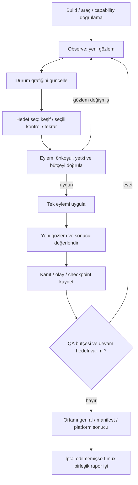
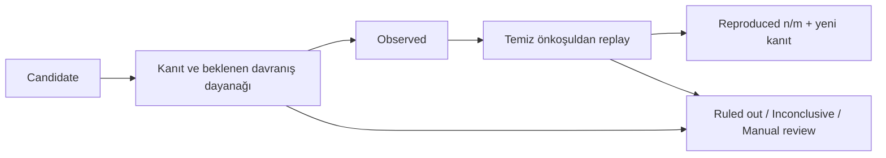

# Otonom Mobil QA — Agent ve Test Tasarımı

Tarih: 3 Ekim 2026  
Durum: İlk sürüm için uygulama tasarımı. Agent, adaptörler, kontrol paketleri ve aşağıdaki bütçeler henüz gerçek WarpBuild pilotuyla doğrulanmamıştır. Örnek sözleşmeler çalışan kod beyanı değildir.

Bu belge [ürün kapsamındaki](01-product-scope-draft.md) beş test modunu, [mimarideki](02-architecture.md) runner ve model katmanları üzerinde nasıl yürüteceğimizi tanımlar. Kurulum, deployment, jüri erişimi ve hata müdahalesi [teslim ve operasyon belgesinde](04-delivery-and-operations.md) tutulur.

## 1. Agent'ın görevi ve bileşenleri

Kullanıcı build, platform ve test modlarını seçer. Test senaryosu yazması gerekmez. Giriş gerektiren uygulamalarda test hesabı/verisi, OTP yöntemi veya gerekli ek bilgi sağlanabilir. Erişilemeyen akış erişim engeli olarak raporlanır; bu ekranların test edildiği varsayılmaz.

Her platform oturumunda bir agent döngüsü ve cihazı yöneten **tek eylem sırası** bulunur. Modlar bu döngüye hedef ve değerlendirme ekler. Birden fazla mod seçmek yeni cihaz job'u açmaz. Android ve iOS bağımsız oturumlar yürütür; anlamsal hedefler ilişkilendirilebilir, locator ve kanıtlar platformlar arasında taşınmaz.

| Bileşen | Sorumluluk |
|---|---|
| Observer | Screenshot, UI hierarchy, uygulama durumu ve ortam koşullarını toplar |
| State graph / memory | Gözlenen ekran/durumları, geçişleri, ziyaretleri ve tamamlanmamış hedefleri tutar |
| Planner — NVIDIA Nemotron | Yeni hedef, sonraki eylem ve beklenen gözlem önerir |
| Mode checks | Seçili mod için kontrol, test hipotezi veya bulgu adayı üretir |
| Validator / scheduler | Öneriyi mevcut gözlem, yetenek, test verisi ve bütçeyle doğrular; sıraya alır |
| Device adapter | Doğrulanmış eylemi Appium/UiAutomator2 veya XCUITest üzerinden uygular |
| Evaluator / reproducer | Sonucu karşılaştırır; adayın kanıtını ve tekrar denemelerini üretir |
| Evidence / event writer | Adım ve artifact ilişkilerini kalıcılaştırır; canlı ilerlemeyi gönderir |

Bunlar runner içindeki modüllerdir; her biri için ayrı LLM agent, sunucu veya job açılmaz. Görsel model yalnız gerekli gözlemlerde screenshot yorumlar. Model çağrıları Vercel'in tek istekli yetkili relay'inden Token Factory'ye gider; uzun döngü runner'da kalır.

Planlama adayı `nvidia/Nemotron-3_5-Lightning`, görsel aday `openbmb/MiniCPM-V-4_5`'tir. Model/endpoint seçimi ve gerçek erişim pilotta doğrulanır. Metin modelinin doğrudan görüntü yorumlayabildiği varsayılmaz; görsel yorum, planlayıcıya kısa yapılandırılmış gözlem olarak aktarılır. [Nebius model kataloğu](https://tokenfactory.nebius.com/model-catalog.md).

## 2. Oturumun çalışma döngüsü



Oturum hazırlıktan sonra `Exploring`, `Testing` ve `Reproducing` fazları arasında geçebilir. Keşif tümüyle bitmeden test başlar; yeni bir akış bulununca keşif devam edebilir. Mevcut ekranlar için pasif kontroller kuyruklanır; cihazı değiştirecek işlem ortak eylem sırasını bekler.

Her adım öncesi iptal/lease ve kalan süre kontrol edilir. Her eylem sonrası yeniden gözlem yapılır; model önerisi doğru kabul edilerek sonuç yazılmaz. Eylem ve checkpoint'ler runner kapanmadan gönderilir. Model timeout'u, Appium transport hatası, erişim engeli ve uygulama davranışındaki hata ayrı kaydedilir.

Kullanıcı iptalinde yeni model veya test eylemi başlatılmaz. Aktif çağrı mümkün olduğunda durdurulur, yüklenmiş kanıt korunur. Workflow/lease kapatma ve deterministik kısmi rapor kuralları `02` ve `04` ile aynıdır.

## 3. Gözlem, ekran grafiği ve hafıza

### 3.1. Gözlem sözleşmesi

| Alan | İçerik |
|---|---|
| Kimlik | `runId`, `sessionId`, `attemptId`, `observationId`, sıra ve zaman |
| Uygulama | Package/bundle ID, foreground/process durumu; varsa activity/context |
| Ekran | Screenshot artifact referansı, görüntü boyutu ve cihaz koordinat dönüşümü |
| UI | Normalize edilmiş öğe referansı, rol/tür, label, ID, bounds, görünür/etkin/focus durumu |
| Koşullar | Orientation, klavye/dialog, scroll konumu, appearance, font scale, izin ve doğrulanmış ağ durumu |
| Bağlam | İlgili test hesabı/fixture kimliği, hedef, önceki eylem ve bekleyen değişiklikler |
| Kalite | Kaynak eksikliği, capture zaman farkı, hierarchy truncation ve kararlılık durumu |

Screenshot ile hierarchy atomik alınmış sayılmaz. Adaptör capture zamanlarını ve layout değişimini kontrol eder; uyumsuz gözlem yeniden alınır. Loading/animasyon beklemesi sınırlıdır. Ekran sürekli değişiyorsa sonsuz beklenmez; sonucun belirsizliği korunur.

Modelin gördüğü `elementRef` yalnız ilgili observation içinde geçerlidir. Runtime'da kalıcı locator tanımı tekrar çözülür; eski Appium element ID'si hafızadan doğrudan kullanılmaz. Native hierarchy'si yetersiz canvas/WebView ekranlarında görsel konum önerisi kullanılabilir; güvenilir hedef bulunamazsa kontrol `Inconclusive` veya erişim engeli olur. Hybrid/WebView desteği ayrıca capability probe gerektirir.

Model girdisi gerekli UI öğeleri, kısa geçmiş özeti, ilgili alt grafik ve kalan hedeflerden oluşur. Bütün log/graph her çağrıda gönderilmez. Kısaltılan hierarchy'nin tam ekranı temsil ettiği iddia edilmez. Şifreler model girdisine yazılmaz; credential referansını adaptör çözer. Bilinen secret alanları hierarchy/log çıktısında maskelenir; sır görünebilen screenshot bölgeleri VLM ve canlı görüntü paylaşımından önce gizlenir ve bu bölgelerde görsel değerlendirme yapılmadığı belirtilir. Örneklerde sentetik test verisi kullanılır.

### 3.2. Ekran ile durumun ayrılması

`ScreenState`, bir ekranın belirli kullanım koşuludur. Profil ekranının normal hali, açık klavye, permission dialog veya kaydedilmemiş değişiklik hali ayrı durumlar olabilir. Görüntü hash'i tek başına durum kimliği değildir.

Fingerprint; platform/context, normalize UI yapısı, önemli semantik öğeler ve test koşullarından üretilir. Saat, rastgele ID ve değişken liste metni gibi içerikler ekran sayısını şişirmez. İddianın konusu olan veri ayrı assertion kaydında korunur; örneğin profil adının değişmesi normalizasyonda kaybolup persistence kontrolünü geçersiz kılmaz.

`Transition`; kaynak/hedef state, semantik eylem, locator stratejisi, önkoşul, test verisi referansı, ortam değişikliği, sonuç ve kanıtı bağlar. Modelin tahmin ettiği ama ziyaret edilmeyen ekran/geçiş graph'ta `observed` sayılmaz.

Hafıza; ziyaret sayıları, denenmiş eylemler, sonuçlar, güvenilir geri dönüş yolları, engeller ve adaylardan oluşur. Gözlenmiş bir yol tekrar kullanılırken her adımın önkoşulu yeniden doğrulanır. Android'deki koordinat veya test hesabı durumu iOS'a kopyalanmaz.

## 4. Hedef seçimi ve döngüden çıkma

Planner, modelin gördüğü uygulamadan hedef üretir; uygulamaya özel hazır senaryo zorunlu değildir. Keşif için henüz denenmemiş anlamlı kontroller, seçili modların erişmesi gereken ekranlar ve bilinen güvenilir dönüş yolları tutulur.

Öncelik sırası:

1. Devam eden eylemin belirsiz sonucunu çöz ve ortamı kararlı hale getir.
2. Kanıtı olan, kullanıcı akışını engelleyen bulgu adayını bütçe uygunsa tekrar doğrula.
3. Seçili kontrolün önkoşuluna veya keşfedilmemiş anlamlı bir hedefe ilerle.
4. Yeni değer üretmeyen ekran/eylem tekrarını bırak; başka frontier seç veya oturumu bitir.

Benzer liste hücrelerinin hepsini açmak yerine temsil edici birkaç öğe seçilir. Aynı hedefe iki sonuçsuz erişim denemesinden sonra hedef engelli olarak kaydedilir. Üç kez aynı durum/eylem döngüsüne düşülürse planner'a yeni gözlem ve döngü özeti verilir; yine ilerleme yoksa dal sonlandırılır. Bu sınırlar başlangıç önerisidir.

Bilinen navigation/replay adımları ve izinli form doldurma gibi işlemler deterministik kontrolcülerce yürütülebilir. Her gözlem için ayrı LLM çağrısı gerekmez; yine de her cihaz eyleminden önce hedef ve durum kontrol edilir. Yeni veya belirsiz durumda Nemotron yeniden planlar. Uzun, doğrulanmadan uygulanan koordinat dizileri kullanılmaz.

UI/UX tek başına seçildiğinde de erişilebilir ekranlar keşfedilir. Keşfin kendisi Functional modunun bütün kontrollerini çalıştırdığı anlamına gelmez. Çalışmayı engelleyen crash/erişim/altyapı durumu seçili moddan bağımsız görünür; diğer mod kontrolleri seçilmediyse `Not tested` kalır.

## 5. Eylem sözleşmesi ve platform yetenekleri

### 5.1. Model önerisi ile cihaz komutunun ayrılması

Aşağıdaki JSON, planlayıcı çıktısı için örnek sözleşmedir:

```json
{
  "schemaVersion": "1",
  "goalId": "edit-profile",
  "observationId": "obs-42",
  "nextAction": {
    "type": "tap",
    "targetRef": "element-9"
  },
  "expectedObservation": {
    "kind": "state_change",
    "basis": "ui_semantics",
    "description": "Profile editing controls become visible."
  },
  "decisionSummary": "Open the discovered profile editor."
}
```

Çıktı Zod/JSON Schema ile doğrulanır; bilinmeyen eylem/alan ve sınır dışı parametre reddedilir. Nebius structured output desteği seçilen modelde ayrıca denenir. Destek varsa `json_schema` kullanılır; her durumda yerel validator zorunludur. Şema desteği yanlış eylemi veya doğru iş kuralını garanti etmez. [Token Factory structured output](https://docs.tokenfactory.nebius.com/ai-models-inference/json).

Validator; etkin lease, observation/precondition, capability, seçili hedef, test verisi ve bütçeyi kontrol eder. Tap için locator önceliği sabit uygulama ID'si/accessibility ID, sonra semantik role/label ve bağlam, en son doğrulanmış görsel koordinattır. Tekil hedef, güncel bounds ve cihaz/görsel ölçek dönüşümü kontrol edilir. Orientation veya klavye değişiminden sonra eski koordinatla işlem yapılmaz.

Komut timeout olursa Save/tap otomatik tekrarlanmaz: ilk komut uygulanmış olabilir. Önce yeni gözlemle sonuç uzlaştırılır; belirsizlik giderilemezse eylem `Inconclusive` olur. Kontrollü rapid-tap senaryosu bunun dışında açık bir test hipotezidir; sayısı ve hedefi önceden sınırlıdır.

### 5.2. İlk adaptör matrisi

Tablo, implementasyon hedefini gösterir. **Supported** etiketi yalnız pinlenmiş ortamda probe/pilot başarılı olduğunda verilir. Probe geçmeyen yetenek seçilebilir görünse bile ilgili kontrol `Unsupported` olarak açıklanır; başarı hanesine yazılmaz.

| Eylem / yetenek | Android Emulator | iOS Simulator | Kontrol koşulu |
|---|---|---|---|
| Tap, text, scroll, screenshot | UiAutomator2 adaptörü | XCUITest adaptörü | Gerçek hedef/etkinlik ve eylem sonrası gözlem |
| Geri / close | Android back veya görünür geri kontrolü | Gözlenmiş navigation back/close kontrolü | Ortak `back` adı aynı platform davranışını garanti etmez |
| Background / foreground / yeniden açma | App lifecycle adaptörü | App lifecycle adaptörü | Process/foreground durumu; yeniden açma ile veri reset'i ayrı |
| Rapid tap | Sınırlı gesture/burst | Double/multi-tap gesture | Normal iki ardışık click hızlı tap testi sayılmaz |
| Boş, uzun, emoji giriş | İzinli input generator | İzinli input generator | Alan türü/uzunluk ve sentetik veri bütçesi |
| Klavye açıkken işlem | Software keyboard doğrulaması | Software keyboard doğrulaması | Klavye gerçekten görünür; hardware keyboard ayarı kayıtlı |
| Orientation | Doğrulanmış rotation | Doğrulanmış rotation | Uygulama destekliyorsa yeni durum; lock tek başına bug değildir |
| İzin kabul/ret | Gerçek dialog veya ayrı izin preset'i | Gerçek dialog veya desteklenen Simulator izin preset'i | İki yöntem ayrı senaryo; otomatik alert kabul/ret kapalı |
| Appearance / metin ölçeği | Doğrulanmış dark mode/font ayarı | Appearance/Dynamic Type adaptörü | Önce/sonra aynı akış; eski değer kapanışta geri alınır |
| Ağ bozma/geri getirme | Cihaz kapsamlı, probe edilmiş kontrol | Ayrı doğrulanmış proxy/fixture adaptörü gerekir | Uygulama etkisi doğrulanır; runner API bağlantısı korunur |
| Platform accessibility audit | Ayrı araç/instrumentation koşuluyla | Uygun Xcode/iOS üzerinde mevcut ekran audit'i | Araç yoksa UI kontrolleri sürer; audit Unsupported |
| Low-memory / gerçek cihaz koşulları | Ortama özel; başlangıç ortak sözleşmesinde yok | İlk Simulator kapsamı dışında | Gerçek cihaz koşulu simüle edildi diye etiketlenmez |

XCUITest; background, gesture, appearance, content size ve bazı izin işlemleri sunar. `enableConditionInducer` ve `sendMemoryWarning` gerçek cihazlarla sınırlıdır. `performAccessibilityAudit`, Xcode 15/iOS 17 ve üzeri koşuluna bağlıdır. Bu API'ler pinlenmiş runner'da ayrı doğrulanır. [XCUITest execute methods](https://appium.github.io/appium-xcuitest-driver/latest/reference/execute-methods/).

iOS için genel WebDriver `back` komutunun başarılı dönüşü, beklenen native geçişin kanıtı sayılmaz; adaptör gözlenen geri/close kontrolünü seçer ve sonucu kontrol eder. [XCUITest navigation implementation](https://github.com/appium/appium-xcuitest-driver/blob/master/lib/commands/navigation.ts).

iOS klavye senaryosu software keyboard varlığıyla doğrulanır. Reduce Motion, idle/animation bekleme ve alert ayarları oturum konfigürasyonuna yazılır; bu ayarlar rapid tap ve animasyon gözlemini etkileyebilir. İzin preset'i uygulama prosesini etkiliyorsa bu değişiklik lifecycle adımı olarak da kaydedilir. [XCUITest capabilities](https://appium.github.io/appium-xcuitest-driver/latest/reference/capabilities/), [settings](https://appium.github.io/appium-xcuitest-driver/latest/reference/settings/).

Android'de Appium/UiAutomator2 sürümü ile minimum OS gereksinimi birlikte pinlenir; font-scale, gesture ve permission işlemleri adaptör probe'undan geçer. Font-scale değeri text bounds için doğrudan çarpan sayılmaz; Android 14 ve üzerindeki büyük metin ölçeklemesi doğrusal olmayabilir. [UiAutomator2 requirements](https://github.com/appium/appium-uiautomator2-driver#requirements), [Android font scaling](https://developer.android.com/about/versions/14/features#non-linear-font-scaling).

Ağ senaryosu ancak test edilen uygulamanın erişiminin değiştiği doğrulanırsa çalıştırılmış sayılır. Host bağlantısını kesmek veya bir Wi-Fi ayarını değiştirip internetin kesildiğini varsaymak geçerli test değildir. Arbitrary iOS build'inde uygun adaptör yoksa ağ senaryosu Unsupported kalır; fixture ile çalışan demo kapsamı ayrıca belirtilir.

### 5.3. Agent sınırları

Model yalnız tanımlı araç tiplerini ve sentetik/verilmiş test verisini kullanır. Serbest shell, arbitrary HTTP isteği, raw Appium execute veya provider secret erişimi yoktur. Cihaz/ortam ayarları güvenilir adaptör kodunda sabit parametre doğrulamasıyla uygulanır. Appium portu internete açılmaz; genel `relaxed-security` üzerinden model komutu kabul edilmez. [Appium security](https://appium.io/docs/en/latest/guides/security/).

Keşif test edilen package/bundle kapsamındadır. İzin dialog'u ve readiness bağlantısının açıldığı browser gibi dış context'ler sınırlı adaptör adımı olarak izlenir; cihazdaki diğer uygulamalar yeni keşif hedefi yapılmaz. Dış bağlantı gözlemi sonunda test edilen uygulamaya doğrulanmış dönüş uygulanır.

Ekran metni, screenshot, WebView ve log içeriği **test edilen veri** olarak işlenir; sistem talimatı veya yetki kaynağı olmaz. Bu içerikler modeli yönlendirmeye çalışsa da validator'ın araç/yetki sınırını değiştiremez. Timeline, kısa eylem/karar özetini gösterir; modelin iç muhakemesi istenmez.

Yazma işlemleri sağlanan test hesabı/veri alanıyla sınırlıdır. Gerçek ödeme, dış kişiye mesaj ve gerçek kullanıcı hesabını silme varsayılan araç kümesinde bulunmaz. Hesap silme readiness kontrolü keşif/kanıt toplar; silmeyi gerçekten çalıştırmak yalnız ayrı disposable fixture sözleşmesiyle mümkün olur.

## 6. Modların ilk kontrol paketi

### 6.1. Functional / User Flows

Keşfedilmiş ekrandan hedef üretilir: giriş, profil açma/düzenleme, kaydetme, tekrar açma ve çıkış gibi. Uygulamada bulunmayan akışlar zorunlu test olarak eklenmez. Giriş bilgisi/OTP yoksa erişilemeyen hedef açıklamalı engel olur.

İlk kontroller: eylem sonrası beklenen UI geçişi, form geri bildirimi, gözlenen veri değişiminin tekrar açılışta korunması ve keşfedilen geri dönüş yolları. Persistence kontrolünde aynı hesap, aynı veri alanı, uygun bekleme ve ağ koşulu korunur. Backend etkisi yalnız UI'dan kesin çıkarılamaz.

Beklenen davranışın dayanağı kayıt edilir:

| `basis` | Anlamı ve sonuç sınırı |
|---|---|
| `developer_contract` | Sağlanan test fixture'ı veya açık ürün davranışı |
| `observed_invariant` | Aynı kontrollü durumda gözlenmiş ilişki; örneğin kaydet → tekrar aç |
| `runtime_signal` | Doğrudan process/crash log'u veya doğrulanmış olay |
| `platform_rule` | Sürümü/tarihi ve applicability'si kayıtlı platform kontrolü |
| `ui_semantics` / `heuristic` | Label/akıştan AI çıkarımı; gerektiğinde Manual review/Potential issue |

Modelin ürünün iş kuralını tahmin etmesi kesin failure üretmez. Bir semptom tekrar gözlense bile dayanak yetersizse beklenen davranış belirsizliği korunur.

### 6.2. Bug / Stress Testing

Ortak keşifte bulunan giriş/eylem/lifecycle noktalarından **tek değişkenli** hipotezler üretilir. Her dal baseline ve temiz önkoşulla başlar; ağ kapalıyken alınan ekran normal baseline olarak kullanılmaz.

İlk adaylar: boş giriş, uzun metin, emoji/Unicode, sınırlı çift/tekrar tap, background/foreground, klavye açıkken işlem ve desteklenen izin/ağ/rotation koşulları. Girdi üreticisi alan türüne uygun sentetik değerler kullanır; aşırı sınırsız payload oluşturmaz. Birden fazla bozucu koşul ancak tek değişkenli aday doğrulandıktan sonra ayrı senaryo olarak denenir.

Crash için uygulama prosesinin kaybı ve varsa ilgili crash log'u aranır. Appium bağlantısının kopması otomatik app crash sayılmaz. İki kayıt veya iki API çağrısı iddiası için ilgili UI/backend gözlemi gerekir; iki tap tek başına duplicate kayıt kanıtı değildir.

Örnek replay:

```text
Precondition: fresh test account, saved profile, baseline network/permissions
Path: launch → profile → edit profile
Perturbation: enter bounded long text → save
Observe: result and logs → reopen profile with the same account
Restore: clear this branch's fixture data and restore environment
Evaluate: compare against the recorded expectation and evidence
```

### 6.3. UI / UX

İlk paket: klavye/overlay altında ulaşılamayan eylem, metin overflow/clipping adayı, element overlap, safe-area/bounds adayı ve benzer bileşenlerde spacing/hizalama tutarlılığı. Görsel model adayın region/bounds referansını ve kısa sebebini verir; mümkün olan kontroller hierarchy/geometri veya etkileşimle desteklenir.

Örneğin bir butonun klavyeyle örtüşmesi tek başına tamamlanamayan akış kanıtı değildir. Scroll veya klavye kapatma ile eyleme erişim denenir; sonuç, gözlenen kullanım etkisiyle yazılır. Tasarım dosyası yoksa tam tasarım eşleşmesi denetimi yapılmış sayılmaz.

Ölçüm, görsel tahmin ve öznel tercih ayrı türlerdir. Sadece estetik yorum, High functional bug olarak gösterilmez. Karşılaştırma aynı platform/ölçek/appearance ve uygun durum bağlamıyla yapılır; farklı platformun farklı tasarım tercihleri tek başına tutarsızlık sayılmaz.

### 6.4. Accessibility

İlk paket: gözlenebilen kontrol label/role/state bilgisi, metin ölçeğinde clipping/erişilemeyen eylem, etkin touch target adayı ve mümkünse mevcut ekran için platform audit çıktısı. Hierarchy'de bulunamayan label, ilgili birleşik control veya screen-reader davranışı incelenmeden kesin erişilebilirlik ihlali sayılmaz.

Android rehberindeki **48dp etkin touch target** önerisi görünür ikon boyutuyla eşit değildir; padding veya genişletilmiş hit area olabilir. Apple'ın güncel iOS/iPadOS tablosu **44×44pt default**, **28×28pt minimum** kontrol boyutu belirtir; 44pt altı otomatik kesin ihlal olarak sınıflanmaz. Platform/context ve gerçek hit area ölçüm kapsamı korunur. [Android accessibility](https://developer.android.com/guide/topics/ui/accessibility/views/apps-views), [Apple HIG accessibility](https://developer.apple.com/design/human-interface-guidelines/accessibility).

Screenshot pikseli doğrudan dp/pt değildir. Adaptör scale dönüşümünü doğrular; hierarchy bounds gerçek touch area'yı göstermiyorsa sonuç adaya dönüşür. Kontrast kontrolünde renk/arka plan ve metin sınıfı yeterince güvenilir ölçülemiyorsa AI yorumu gösterilir. WCAG kriteri kullanılırsa kriter ve uygulanabilirlik belirtilir; sınırlı screenshot/audit sonucu tam WCAG uygunluğu olarak sunulmaz. [WCAG 2.2](https://www.w3.org/TR/WCAG22/).

Audit başarısı yalnız yapılan kontrol ve ziyaret edilen durum için geçerlidir. Tam VoiceOver/TalkBack keşfi, özel gesture kapsamı ve bütün uygulamanın erişilebilirlik sertifikasyonu ilk paket değildir.

### 6.5. Store Readiness

İlk paket: gözlenen hesap oluşturma/silme girişleri, privacy policy bağlantısının bulunabilirliği/açılabilirliği, ilgili izin açıklamaları ve runtime dışı gerekli bilgilerin eksikliği. Kurallar modelin hafızasından üretilmez; kontrollü rule pack'teki `ruleId`, kaynak URL, kontrol tarihi, platform, applicability ve gerekli kanıt alanları kullanılır.

Hesap oluşturan uygulamalarda Apple'ın uygulama içi silme şartı ve Google kapsamındaki uygulamalarda uygulama içi yol ile web deletion resource şartı ilgili kaynaklarla eşleştirilir. Bir akışın keşfedilememesi yokluğunun kesin kanıtı değildir; buton bulunması da backend verilerinin silindiğini doğrulamaz. [Apple App Review Guidelines 5.1.1](https://developer.apple.com/app-store/review/guidelines/#privacy), [Google account deletion](https://support.google.com/googleplay/android-developer/answer/13327111).

Çıktı `Evidence found`, `Potential risk`, `Needs additional information`, `Not applicable` veya `Not assessed` olabilir. Play/App Store metadata, gizlilik beyanının doğruluğu ve gerçek cihaz davranışı eksikse ilgili kapsam açık bırakılır. Android runtime bulgusu iOS Runtime Verified sayılmaz; iOS kanıtı **Simulator** olarak etiketlenir. Mağaza kabul garantisi veya genel compliance puanı üretilmez.

### 6.6. Animasyon ve performans gözlemleri

İlk sürümde ayrı kapsamlı Performance modu yerine, ilgili UI/UX ve runtime bulgularına sınırlı transition/video gözlemi eklenir. Kısa video segmenti ve eylemden kararlı gözleme kadar geçen süre kaydedilebilir; bunlar capture/Appium/runner beklemelerinin etkisini içerir.

Video üzerinden görülen takılma `Potential animation issue` olabilir; ölçülmüş FPS/frame-drop sayılmaz. Trace/frame metriği sonradan eklenirse araç, veri kaynağı ve ölçüm penceresi rapora yazılır. Emulator/Simulator zamanı gerçek cihaz performansını doğrulamaz. [Android rendering ölçümü](https://developer.android.com/topic/performance/issues/render), [Apple simulated/physical devices](https://developer.apple.com/documentation/xcode/running-your-app-on-simulated-or-physical-devices).

## 7. Bulgu doğrulama ve tekrar üretim



Görsel/iş kuralı hipotezi, yalnız modelin tekrar aynı yorumu yapmasıyla doğrulanmaz. `verification`, `expectationBasis`, `confidence` ve `severity` ayrı alanlardır. Tekrar edilmiş bir gözlem, belirsiz iş kuralını kesinleştirmez. Araç audit'i veya doğrudan ölçüm için ilgili doğrulama yöntemi ayrıca gösterilir; bütün bulguların aynı şekilde üç replay gerektirdiği varsayılmaz.

Replay; platform/build, semantik yol, yeniden çözülecek locator'lar, test verisi, önkoşul, koşul değişikliği, beklenen/gözlenen sonuç ve artifact referanslarını içerir. Koordinat tek başına replay tanımı değildir. Aynı senaryodaki gereksiz navigation adımları, bütçe varsa azaltılarak daha kısa tekrar yolu çıkarılır.

Reset dört parçadan oluşur: uygulama/process durumu, cihaz ayarları/izinler, local uygulama verisi ve uzak backend fixture'ı. Her senaryo hangilerini resetlediğini kayıt eder. Reinstall/clearApp bütün izin, keychain veya backend verisinin temizlendiği anlamına gelmez. Başlangıç fixture'ı doğrulanamıyorsa bağımsız temiz tekrar sonucu yazılmaz.

İlk semptom gözlemi ayrı tutulur. **`n/m`, ilk gözlemden sonraki geçerli ve gerçekten tamamlanan replay denemelerinde semptomun yeniden görülme oranıdır.** Reset/erişim/altyapı engelli denemeler ayrıca listelenir; denominator'a sessizce başarılı/başarısız olarak eklenmez. Örnek: hedef 3, başlatılan 3, geçerli 2, semptom 1, reset engeli 1 → `Reproduced 1/2; one blocked attempt`.

En çok üç geçerli replay ve toplam dört replay girişimi yapılır; kalan global süre/eylem/model bütçesi daha önce durdurabilir. İptal veya budget stop sonucunda gerçek `n/m` korunur. Bir kez gözlenen ciddi crash'in tekrar edilememesi ilk kanıtı silmez; sonuç `Observed; reproduction incomplete` olabilir.

Severity etkiyle gerekçelendirilir: kritik veri kaybı veya uygulamanın ana işlevinin doğrulanmış genel engeli Critical/High adayı olabilir; sınırlı akış engeli, workaround ve kullanıcı etkisiyle değerlendirilir. Öznel spacing yorumu Critical sayılmaz. Bilinmeyen etki için severity tahmini ve belirsizlik açık yazılır.

## 8. Kanıt, canlı olaylar ve rapor

Kanıt toplama modeli: her anlamlı eylem sonrası screenshot/hierarchy özeti; şüpheli adımda öncesi/sonrası kanıt, ilgili log penceresi ve varsa kısa video. Değişmeyen görüntüler yeniden VLM çağrısı gerektirmez. Görsel kontroller yeni state, önemli koşul değişimi veya bulgu adayı üzerinde önceliklendirilir.

Artifact; platform/build/attempt/step, zaman, koşul, checksum ve R2 nesne yoluyla ilişkilendirilir. Yüklenip doğrulanmadan `ready` olayına bağlanmaz. Screenshot ile log/video zamanları eşleştirilir; olmayan video/log rapora varmış gibi eklenmez. Modelin işaretlediği region, gerçek screenshot koordinat sistemine dönüştürülür.

`RunEvent`; kimlik/monoton sequence, faz, hedef, eylem özeti, gözlenen sonuç, artifact referansı ve engel/bütçe sebebi taşır. Ağ bağlantısı geri geldiğinde event ID/sequence ile tekrar gönderim tekilleştirilir. DB kaydı ile artifact hazır durumu authoritative'dir; tarayıcı bağlantısının kopması testi durdurmaz.

| Finding alanı | İçerik |
|---|---|
| Kaynak | Run/session/build hash, platform/OS/araç profili, ilgili goal/check |
| İddia | Kısa problem, beklenen/gözlenen davranış, expectation basis |
| Doğrulama | Observed/Reproduced/Manual review, gerçek n/m ve engelli girişimler |
| Kanıt | Adımlar, locator tanımı, fixture/koşul, screenshot/video/log referansları |
| Etki | Severity gerekçesi, workaround ve belirsizlik |
| Sürüm | Agent, prompt, check/rule pack, budget ve model kimlikleri |

Linux rapor işi kalıcı platform sonuçlarını birleştirir. Deterministik alanlar gerçek kayıtlardan gelir; model yalnız kısa açıklama/özet önerir, yeni kanıt, severity yükseltmesi veya tekrar sayısı icat edemez. Üretilen metnin finding/artifact referansları doğrulanır. Model özeti başarısızsa temel rapor mevcut alanlardan tamamlanabilir; report altyapı hatası ve retry `04`'teki prosedürü izler.

Android/iOS benzer bulguları ortak başlık altında ilişkilendirilebilir; doğrulama ve tekrar oranı platform başına korunur. Eksik platform sonucu Partial'dır. `Completed`, yürütmenin bittiğini belirtir; bütün uygulamanın hatasız olduğunu belirtmez. Dashboard; gözlenen ekran/durum, geçiş, eylem ve test edilen kontrol sayılarını gösterir, bilinmeyen toplamdan coverage yüzdesi çıkarmaz.

## 9. Başlangıç bütçeleri ve durma kuralları

Aşağıdakiler **pilot için önerilen default konfigürasyondur**; performans garantisi veya ulaşılması gereken hedef değildir. Her run konfigürasyonun snapshot'ını ve `budgetVersion`'ını saklar. Seçili modlar aynı platform bütçesini paylaşır; mod sayısıyla bütçe otomatik çarpılmaz.

| Bütçe | İlk öneri |
|---|---|
| Cihaz job hard timeout | Platform başına 20 dakika |
| QA soft stop | Job başlangıcından 17. dakikada yeni QA/model işi durur; son 3 dakika kapanış/manifest payıdır |
| Hazırlık | En çok 5 dakika; başarısızsa açıklamalı altyapı/girdi sonucu |
| Cihaz eylemi | Platform başına en çok 120; replay ve deterministik navigation dahil |
| Planner çağrısı | Platform başına en çok 30 provider isteği; repair/retry dahil |
| Görsel çağrı | Platform başına en çok 30 provider isteği; repair/retry dahil |
| Geçersiz model çıktısı | En çok 1 repair; yine hatalıysa o karar uygulanmaz |
| Geçici model hatası | En çok 2 backoff retry; kalan bütçe/süre uygunsa |
| Aynı erişim hedefi | En çok 2 sonuçsuz girişim; döngü tespiti ayrıca uygulanır |
| Bulgu replay | En çok 3 geçerli deneme, en çok 4 toplam girişim; global bütçe daha erken durdurabilir |
| Video | Hedefli, en çok 15 saniyelik segment; platform başına en çok 5 segment |
| Rapor job'u | Normal plan 3 dakika; hard timeout 5 dakika |

Rapid-tap burst'ündeki her tap eylem sayısına dahildir; ayrı fixture/reset ve ortam değişiklikleri de kayıtlı bütçe tüketir. Kapanıştaki geri alma/yükleme için ayrılan pay QA eylem tavanından ayrı izlenir. Device/model timeout'u ve retry beklemesi kalan QA deadline'ına göre kısaltılır. Hard timeout son korumadır; artifact upload yalnız bu ana bırakılmaz.

QA için kullanılabilir zaman hazırlık sonrası kalan soft-deadline süresidir. İlk paylaşım önerisi: yaklaşık %35 keşif, %35 seçili kontrol, %20 replay ve %10 toparlanma payı. Basit bir modda kullanılmayan pay aynı oturumun hedeflerine aktarılabilir. Yeni stress dalı açmadan önce reset/tekrar maliyeti için yeterli pay bırakılır.

Model tüketimi için başlangıç kabul bütçesi:

| İş | Input / output token kabul hedefi |
|---|---|
| Android planner | 90.000 / 13.000 |
| iOS planner | 90.000 / 13.000 |
| Birleşik rapor rezervi — Nemotron | 20.000 / 4.000 |
| Android vision | 75.000 / 9.000 |
| iOS vision | 75.000 / 9.000 |

İki platformda toplam hedef `200.000/30.000` planner ve `150.000/18.000` vision token'ıdır; `02`'nin çift koşu maliyet varsayımıyla aynı başlangıç noktasını kullanır. Tek platformda diğer platform payı otomatik eklenmez. Rapor ilk pakette metin sonuçlarını okur; yeni vision çağrısı planlanmaz.

Relay, çağrı öncesi tahmini input ve izinli output için rezerv alır; paralel istekler aynı bakiyeyi iki kez kullanamaz. Gerçek API usage sonrasında rezerv düzeltilir. Görsel token tahmini ve eksik usage belirsizdir; bütçe kesin fatura üst sınırı diye sunulmaz, bilinmeyen tüketim sıfır sayılmaz. Repair/retry ve rapor aynı toplamda sayılır. Limit aşılacaksa daha büyük context göndermek yerine hedef açık sonuçla durur.

Stop sebepleri ayrı tutulur: `goals_exhausted`, `budget_exhausted`, `access_blocked`, `unsupported`, `cancelled`, `infrastructure_failed`. Bütçe bittiğinde başlanmamış kontrol `Not tested`, sonucu karara bağlanmamış kontrol `Inconclusive` olur. Geçmiş başarılı kontroller silinmez; bütün seçili modlar passed yapılmaz.

20 dakika job sınırı ve 3 dakika rapor planı, sağlayıcının gerçek faturalanan süresinin ölçümü değildir. Hazırlık/queue, actual usage, kapanış ve timeout davranışı pilotta ölçülüp `02` maliyet hesabı ve `04` operasyon konfigürasyonuna birlikte yansıtılır.

## 10. Agent kalite değerlendirmesi ve pilot

Örnek uygulama hem canlı demo hem değerlendirme fixture'ı olarak kullanılabilir; **beklenen bug listesi agent'ın girdisi değildir**. Ground-truth manifest yalnız koşu sonrasında çalışan bağımsız kalite değerlendirmesine verilir; runtime mode checks/evaluator, planner prompt, VLM gözlemi, memory veya hazır replay hedefine eklenmez. Bu değerlendirme üretim testine ek cihaz job'u açmak zorunda değildir; tamamlanmış çıktıların manuel/yerel incelenmesiyle yapılabilir. Fixture/reset kimliği gerekli erişim verisidir; bug etiketi, doğru eylem dizisi ve beklenen finding metni ayrı tutulur.

| Pilot | Ölçülen davranış |
|---|---|
| İki platform temel zinciri | Build → açılış → eylem → canlı kanıt → platform sonucu → rapor |
| Kasıtlı hata içeren sample | Keşfedilen akış, gözlenen seed semptom, bağımsız replay ve kanıt |
| Düzeltilmiş kontrol build'i | Aynı hipotezin sağlıklı davranışını ayırma; yanlış kesin bulgu |
| Önceden görülmemiş/değiştirilmiş akış | Label/sıra/layout değişiminde yeni keşif; hardcoded demo yoluna bağımlılık |
| Mod/capability kombinasyonları | Tek mod ve birlikte modlar; unsupported izin/ağ/audit doğru sonucu |
| Agent sınırları | UI kaynaklı yönlendirme, stale hedef ve timeout sonrası belirsiz eylem; yetkisiz komut uygulanmaması |
| Reset/bütçe/iptal | Temiz tekrar doğrulaması, bounded stop, kapanış ve gerçek n/m |

Kalite kaydı; ortam/config sürümü, gözlenen akışlar, manuel incelenmiş bulgular, kaçan seed senaryoları, yanlış kesin bulgular, kanıt bütünlüğü, runtime ve gerçek tüketimi içerir. Sample'a ait bilinen ground truth için oran hesaplanabilir; arbitrary uygulamanın toplam bilinmeyen bug sayısı üzerinden recall iddiası yapılamaz. Replay başarısı locator'ların kullanılabilirliğiyle ayrıca değerlendirilir.

Demo kaydı ile agent kalite sonucu ayrıdır. Jüriye gösterilen tamamlanmış rapor gerçek run çıktısıdır; yalnız başarılı koşuları seçip başarısız denemeleri kalite ölçümünden çıkarmayız. Model/config aynı kalsa da bütün AI kararlarının deterministik olacağı garanti edilmez.

İlk kabul hedefleri: iki platform temel zinciri geçmeli; seed bulgu için gerçek kanıt/replay görülmeli; sağlıklı kontrolde yanlış kesin sonuçlar değerlendirilip çözülmeli; değişmiş akışta keşif denenmeli; bütçe/iptal/unsupported sonuçları doğru olmalı. Bunlar geçmeden destek etiketi veya örnek başarı raporu yayınlanmaz.

## 11. Implementasyon sırası ve açık kararlar

1. Platform adaptörleri, observation/eylem validator'ı, capability probe ve periyodik kanıt.
2. Normalize state graph, bounded keşif ve Nemotron planlama; deterministik navigation.
3. Functional/persistence ve kontrollü input/lifecycle stress dalları; oracle ve reset kayıtları.
4. UI/UX, accessibility ve tarihli readiness check paketleri; desteklenmeyen yeteneklerin görünümü.
5. Candidate doğrulama/replay, birleşik rapor, bütçe uygulaması ve kalite pilotları.

Beş mod ürün kapsamındadır; sıra ortak temeli önce kurmak içindir. Geniş cihaz matrisi, self-hosted runner, repo-to-build, gerçek cihaz performance ve kapsamlı screen-reader keşfi sonraki aşamalardır.

Pilot sonrası kesinleşecekler: pinlenmiş araç/OS sürümleri, gerçekten desteklenen capability'ler, locator fallback kalitesi, rule/check/prompt pack sürümleri, ilk mod kontrol listesi, timeout ve budget değerleri, reset fixture'ları, görüntü/token tüketimi ve model seçimleri. Nihai değerler `04`'ün operasyon kaydına yazılır; maliyet değişirse `02` güncellenir.
