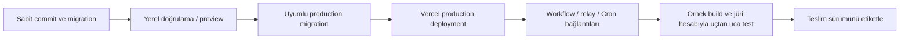

# Otonom Mobil QA — Teslim ve Operasyon

Tarih: 3 Ekim 2026  
Durum: Onaylanan mimariye göre uygulama ve teslim planı. Bu belge hazırlanırken uygulama kodu, deployment, jüri hesapları ve gerçek test çıktıları henüz oluşturulmamıştır. Abonelik satın alımı veya servis kurulumu yapılmamıştır.

Bu belge [ürün kapsamını](01-product-scope-draft.md) ve [sistem mimarisini](02-architecture.md) çalıştırılabilir bir jüri demosuna dönüştürmek için izlenecek yolu tanımlar. Agent stratejileri, kontrol paketleri ve başlangıç bütçeleri [agent ve test tasarımında](03-agent-and-test-design.md), ayrıntılı maliyet hesabı mimari belgesinde tutulur. Kurulum, demo ve operasyon için ek belge dosyaları açılmaz; public repo'nun İngilizce `README.md` dosyası kısa giriş noktası olur.

## 1. Teslim hedefi ve takvim

Hedef: Jüri, verilen hesapla web arayüzüne girerek hazır Android ve iOS build'leri üzerinde yeni test başlatabilmeli; platformların ilerlemesini, kanıtları ve birleşik raporu görebilmeli. Uyumlu kendi build'ini yükleme yolu da çalışmalı. Jüriye API anahtarı, sağlayıcı hesabı veya ödeme gereksinimi çıkarılmaz; bu demo için servis giderlerini proje sahibi karşılar.

| Aşama | Türkiye saati — Europe/Istanbul |
|---|---|
| Son teslim | **30 Ekim 2026, 20.00** |
| Değerlendirme başlangıcı | **1 Aralık 2026, 20.00** |
| Değerlendirme sonu | **15 Aralık 2026, 23.00** |

Kurallar, çalışan projeye ücretsiz ve kısıtlamasız jüri erişimi ister; jürinin projeyi çalıştırması zorunlu değildir. Kapalı sitede giriş bilgileri testing instructions alanına eklenir. Public kaynak repo, açık kaynak lisansı, kurulum açıklaması, İngilizce teslim materyalleri ve YouTube'da kamuya açık, **üç dakikadan kısa** demo video hazırlanır. Kullanılan NVIDIA modeli ve Nebius runtime entegrasyonu açıklanır; track seçimi ve kullanılan araçlara geri bildirim teslimde yer alır. [Yarışma kuralları](https://nebiusglobalaihackathon.devpost.com/rules).

Bu proje için `Best Apps and Agents` track'i başlangıç tercihidir; son seçim Devpost formunda doğrulanır. NVIDIA Nemotron'un gerçek Token Factory çağrıları çalışma kayıtlarıyla gösterilir. Mimariye ek Nebius servisi eklemek teslim hedefi değildir.

Türkçe belgeler çalışma dokümanlarıdır. Teslime dahil edilen içeriklerin İngilizce karşılıkları hazırlanır; gerekirse aynı dosyaların teslim sürümü İngilizce yapılır. Yalnız README'yi çevirmek, teslim edilen diğer Türkçe materyallerin çeviri gereksinimini karşılamaz.

## 2. Ortamlar ve sürüm düzeni

| Ortam | Kullanım | Veri ve yetki |
|---|---|---|
| Local | Next.js, agent modülleri ve DB migration geliştirme | Yerel Supabase ve sentetik veri; gerçek jüri hesapları kullanılmaz |
| Preview | Arayüz ve kısa API değişikliklerini inceleme | Production secret'ları otomatik kopyalanmaz; ücretli test çalıştırma açıkça yapılandırılmadıkça kapalıdır |
| Production | Jüri demosu ve gerçek GitHub Actions cihaz testleri | Vercel Pro, tek Supabase Pro/Micro projesi (private Storage dahil) ve Token Factory |

İkinci ücretli Supabase projesi başlangıç bütçesine dahil değildir. Preview için gerekirse ayrı test kaynakları kullanılır ve maliyeti ayrıca hesaplanır. Development/Preview bağlantıları production verisine yazacak şekilde kurulmaz.

Production için sabit bir `APP_BASE_URL` seçilir: özel domain veya projenin sabit production `vercel.app` adresi. Runner callback'leri, model relay ve Cron bu adresi kullanır; deployment'a özgü geçici URL'ler kullanılmaz. Vercel Standard Protection, generated deployment URL'lerini de koruyabildiğinden jüri adresi ve dış servis erişimi ayrıca denenir. Jüri giriş ekranı Vercel hesabı istememelidir. [Vercel Deployment Protection](https://vercel.com/docs/deployment-protection).

Preview otomasyonuna koruma aşma yetkisi gerekirse `x-vercel-protection-bypass` yalnız servisler arasında kullanılır. Bu header, uygulamanın runner veya bakım çağrısı kimlik doğrulamasının yerine geçmez. [Automation bypass](https://vercel.com/docs/deployment-protection/methods-to-bypass-deployment-protection/protection-bypass-automation).

Repo'da uygulama koduyla birlikte versioned Supabase migration'ları, güvenilir GitHub workflow'ları, örnek uygulama kaynakları ve placeholder `.env.example` tutulur. Node.js, paket yöneticisi, Appium driver'ları, Android SDK/emulator, macOS/Xcode/simulator ve GitHub Action sürümleri pilot sonrası sabitlenir. Belgede henüz mevcut olmayan bir kurulum script'inin çalıştığı varsayılmaz.

## 3. Yapılandırma ve anahtarlar

Aşağıdaki adlar **uygulama geliştirilirken kullanılacak yapılandırma sözleşmesidir**; mevcut environment değişkenleri değildir. Gerçek değerler repoya, video kaydına veya bu belgeye yazılmaz.

| Değişken / grup | Saklandığı yer | Amaç |
|---|---|---|
| `NEXT_PUBLIC_SUPABASE_URL`, `NEXT_PUBLIC_SUPABASE_PUBLISHABLE_KEY` | Vercel, browser'a açık | Supabase kullanıcı oturumu ve RLS ile erişim |
| `APP_BASE_URL` | Vercel ve güvenilir workflow config | Sabit production origin |
| `SUPABASE_SECRET_KEY` | Yalnız Vercel server | Yetkili admin/RPC işlemleri; browser istemcisinden ayrı |
| `TOKEN_FACTORY_API_KEY`, `TOKEN_FACTORY_BASE_URL` | Yalnız Vercel server | Hesapta doğrulanmış Nebius endpoint'i ve model erişimi |
| `NEMOTRON_MODEL_ID`, `VISION_MODEL_ID` | Vercel server config | Pilotla doğrulanan model allowlist'i |
| `STORAGE_BUILDS_BUCKET`, `STORAGE_EVIDENCE_BUCKET` | Vercel server config | Private bucket adları; imzalar `SUPABASE_SECRET_KEY` ile server'da üretilir |
| `GITHUB_APP_ID`, `GITHUB_APP_INSTALLATION_ID`, `GITHUB_APP_PRIVATE_KEY` | Yalnız Vercel server | Seçili repoya bağlı dispatch/provider erişimi |
| `GITHUB_REPOSITORY`, `GITHUB_WORKFLOW_ID`, `GITHUB_WORKFLOW_REF` | Vercel server config | İzinli repo, workflow ve branch/tag referansı |
| `RUNNER_TOKEN_SIGNING_KEY`, `RUNNER_OIDC_AUDIENCE` | Vercel server; audience workflow'a açık | Doğrulanmış job'a sınırlı uygulama token'ı verme |
| `CRON_AUTH_SECRET` | Vercel server ve Supabase Vault | Bakım endpoint'ine ayrı servis yetkisi |
| `APP_CREDENTIALS_ENCRYPTION_KEY` | Yalnız Vercel server | Test edilen uygulamanın gerekli giriş bilgilerini şifreleme |

Production ve Preview değerleri ayrı tanımlanır. `NEXT_PUBLIC_` yalnız tarayıcıya açık olması gereken değerlerde kullanılır; environment değişiklikleri ilgili yeni deployment'ta doğrulanır. [Next.js environment variables](https://nextjs.org/docs/app/guides/environment-variables), [Vercel environment variables](https://vercel.com/docs/environment-variables).

Runner'a Token Factory veya Supabase admin/secret anahtarı verilmez. Runner, GitHub OIDC kimliğini API'de doğrulatarak yalnız kendi `run/session/attempt/lease` kapsamına bağlı süreli token ve dosya URL'leri alır. Linux rapor job'u ayrı `reportAttempt/reportLease` yetkisi alır; cihazı yönetemez. JWT, şifre, imzalı URL ve yetki header'ları log'lardan maskelenir.

OIDC doğrulamasında imza/JWKS, issuer, audience, süre, repository kimliği, güvenilir workflow/ref ve commit, GitHub run/attempt ile beklenen DB kaydı birlikte kontrol edilir. Sadece `runId` veya repository adına güvenilmez. `job_workflow_ref` alanı reusable workflow kullanıldığında değerlendirilir. [GitHub OIDC](https://docs.github.com/en/actions/reference/security/oidc).

Jüri dashboard şifrelerini Supabase Auth yönetir. Test edilen uygulamanın şifresi ayrı bir sırdır; yalnız ilgili runner'a gerekli süre boyunca açılır. Gerçek jüri parolası public README veya `.env.example` içinde bulunmaz. Sızan sağlayıcı anahtarı iptal edilip yenilenir; Git geçmişini temizlemek tek başına yeterli işlem değildir. [GitHub secret scanning](https://docs.github.com/en/code-security/concepts/secret-security/secret-scanning).

## 4. Servislerin ilk kurulumu

Kurulum bağımlılık sırasıyla ilerler. Her adımda alınan gerçek kimlikler ve doğrulama sonuçları erişimi kısıtlı operasyon kaydında tutulur.

### 4.1. Supabase: veri, hesap ve olaylar

1. Avrupa bölgesinde tek production Supabase Pro/Micro projesi oluşturulur.
2. Koşu, platform oturumu, artifact, bulgu, `RunEvent`, outbox, rapor denemesi ve tüketim şeması migration ile kurulur. Atomik run oluşturma ve claim/lease RPC'leri aynı migration düzenine alınır.
3. Exposed tablolarda gerekli grants ve RLS tanımlanır. Kullanıcı kendi koşularını ve açıkça izin verilen paylaşılan örnekleri okuyabilir; diğer kullanıcıların verisine erişemez. Admin istemcisinin RLS'yi aşan işlemleri uygulama düzeyinde ayrıca yetkilendirilir.
4. Gerekli olay/durum tabloları mevcut `supabase_realtime` publication'ına migration ile eklenir. Aynı jüri JWT'siyle hem SELECT hem gerçek event teslimi denenir; `SUBSCRIBED` yanıtı tek başına yeterli değildir.
5. Genel kayıt kapatılır. Jüri hesabı server-only `admin.createUser` ile `email_confirm: true` kullanılarak oluşturulur; hazır e-posta/şifreyle giriş denenir. Demo, davet e-postası veya SMTP'nin çalışmasına bağımlı kalmaz.

Migration geçmişi production ile uyuşmazsa sebebi çözmeden otomatik `migration repair` uygulanmaz. Kimlik yetkileri kullanıcı tarafından değiştirilebilen `user_metadata` alanından alınmaz. [Migrations](https://supabase.com/docs/guides/deployment/database-migrations), [RLS](https://supabase.com/docs/guides/database/postgres/row-level-security), [Realtime troubleshooting](https://supabase.com/docs/guides/troubleshooting/realtime-postgres-changes-troubleshooting), [admin.createUser](https://supabase.com/docs/reference/javascript/auth-admin-createuser).

Next.js, `@supabase/ssr` ile request başına server client oluşturur. Kimlik doğrulaması için doğrulanmış claims kullanılır; `getSession()` tek başına yetkilendirme kanıtı sayılmaz. Kullanıcı cookie'sini taşıyan client istekler arasında paylaşılmaz; oturumlu sayfalar ortak cache/ISR ile servis edilmez. [Supabase SSR](https://supabase.com/docs/guides/auth/server-side/creating-a-client?framework=nextjs), [SSR cache ve client paylaşımı](https://supabase.com/docs/guides/auth/server-side/advanced-guide).

### 4.2. Supabase Storage: build ve kanıt

Aynı Supabase Pro projesinde iki **private** bucket açılır: `builds` (APK/ZIP; 300 MB sınırı; yalnız `application/vnd.android.package-archive` ve `application/zip`) ve `evidence` (screenshot/log/video/rapor; 50 MB sınırı). Proje genelindeki dosya sınırı en büyük bucket sınırına göre ayarlanır. Bucket'lar ve sınırları migration ile tanımlanır. `storage.objects` üzerinde tarayıcıya açık politika yoktur; bütün imzalı yükleme/indirme URL'leri server'daki secret key ile üretilir. Public bucket ve public URL kullanılmaz. [Storage access control](https://supabase.com/docs/guides/storage/security/access-control), [dosya sınırları](https://supabase.com/docs/guides/storage/uploads/file-limits).

Build yüklemesi `builds/staging/` yoluna imzalı yükleme URL'siyle doğrudan yapılır. 6 MB üzerindeki dosyalarda aynı imzalı token ile resumable (TUS) yükleme kullanılır. Finalize işleminde boyut ve mevcut metadata kontrol edilir; teste alınacak nesne `builds/final/` altında, yeniden yükleme yetkisi verilmeyen bir yola sabitlenir. Runner gerçek binary hash'ini hesaplayıp platform/ABI doğrulamasını yapar. Yeni upload yeni nesne kimliği alır; tamamlanmış build kaydı sonradan farklı binary'ye yönlendirilmez.

Supabase imzalı yükleme URL'si 2 saat geçerlidir ve süre dolana kadar tekrar kullanılabilir; tek kullanımlık sayılmaz. Resumable yükleme oturumu en çok 24 saat sürer. Kalıcı kayıtta URL yerine nesne yolu ve hash tutulur. Dashboard, kanıtı açarken kullanıcı yetkisini tekrar kontrol edip kısa süreli yeni indirme URL'si alır; haftalar sonra eski URL'nin çalışması beklenmez. Büyük dosyalar Vercel API body'sinden geçirilmez. [Signed upload URL](https://supabase.com/docs/reference/javascript/storage-from-createsigneduploadurl), [Resumable uploads](https://supabase.com/docs/guides/storage/uploads/resumable-uploads).

### 4.3. GitHub Actions: gerçek cihaz işleri

V1 cihaz işleri public repoda GitHub-hosted standart runner'larda çalışır (8 Ekim kararı; WarpBuild kişisel hesapları desteklemiyor). Dispatcher için repository-scoped GitHub App installation token kullanılır; gerekli Actions write yetkisi tanımlanır. İlk entegrasyonda fine-grained PAT kullanılacaksa aynı repo ve yetkilerle sınırlandırılır, süre sonu takip edilir. Job OIDC'si Vercel'in GitHub dispatch credential'ının yerine geçmez. [GitHub workflow dispatch](https://docs.github.com/en/rest/actions/workflows#create-a-workflow-dispatch-event).

Workflow, güvenilir branch/tag referansından çalıştırılır; `contents: read` ve bootstrap için `id-token: write` kullanır. Dispatch cevabı kalıcı outbox'a kaydedilir. Güncel GitHub API sürümündeki `workflow_run_id` sonucu alınır; belirsiz yanıt yeniden dispatch öncesi sağlayıcıyla uzlaştırılır.

| Job | Kurulum doğrulaması |
|---|---|
| Android | `ubuntu-24.04`, KVM udev izni, x64 emulator (API 35); APK yükleme/açma, bir eylem ve screenshot (`device-smoke.yml`) |
| iOS | `macos-26`, Xcode 26.6 ve iOS 26.x Simulator, XCUITest; ARM64 Simulator `.app` yükleme/açma, bir eylem ve screenshot (`device-smoke.yml`) |
| Rapor | Küçük Linux runner; iki platformun terminal/kısmi sonuçlarını okuma, rapor yetkisi, model relay ve sonuç callback'i |

Android için KVM erişimi ve emulator hızlandırması gerçekten doğrulanır. Fiziksel iPhone build'i `.ipa`, Simulator girdisi olarak kabul edilmez. Runner diski job sonunda silindiği için screenshot/log/checkpoint yüklemeleri test boyunca yapılır. [GitHub-hosted runners](https://docs.github.com/en/actions/reference/runners/github-hosted-runners), [Android KVM](https://github.blog/changelog/2024-04-02-github-actions-hardware-accelerated-android-virtualization-now-available/).

### 4.4. Vercel, Token Factory ve bakım çağrısı

Vercel Pro deployment, Supabase projesine yakın uygun Avrupa bölgesinde çalışır. Model anahtarı yalnız server relay'e eklenir. Nemotron planlama ve görsel model için gerçek authenticated API çağrıları yapılır; model kimliği, endpoint, şema, latency ve usage kaydı doğrulanır. Model allowlist'i ve istek bütçesi uygulanır. [Token Factory quickstart](https://docs.tokenfactory.nebius.com/quickstart).

Supabase Cron, Vault'ta tutulan **ayrı** `CRON_AUTH_SECRET` ile kısa Vercel bakım endpoint'ine HTTPS bearer çağrısı yapar. Bu, projenin uygulama tasarımıdır; Supabase publishable key'i bu endpoint'i yetkilendirmez. Bakım API'si kısa batch içinde pending outbox, heartbeat/provider sonucu ve rapor retry'ını atomik claim ile işler. [Supabase scheduling](https://supabase.com/docs/guides/functions/schedule-functions), [Vault](https://supabase.com/docs/guides/database/vault).

`pg_net` çağrısının request ID'si veya Cron SQL başarısı, HTTP/iş başarısı değildir. HTTP timeout'u bakım batch'ine göre açık seçilir; response durumu ve timeout/hata bilgisi izlenir. Kalıcı iş kaynağı DB outbox ve run kayıtlarıdır; geçici `pg_net` response kayıtlarına güvenilmez. [pg_net](https://supabase.com/docs/guides/database/extensions/pg_net).

## 5. Yayına alma ve kabul kontrolleri



Production migration yeni uygulama ve önceki çalışan sürümle uyumlu hazırlanır. Başlangıçta eklemeli değişiklikler tercih edilir. Migration başarıyla uygulanmadan ona bağımlı deployment yayına alınmaz. DB migration'ı ile Vercel deployment'ın tek atomik işlem olduğu varsayılmaz; geri alma yolu önceden kontrol edilir.

Aşağıdaki kontrollerin kanıtı alınmadan demo hazır sayılmaz:

- [ ] Gizli tarayıcı penceresinden jüri hesabıyla giriş; public signup kapalı; başka hesaba ait koşu/API/artifact erişimi reddediliyor.
- [ ] Hazır APK ve Simulator build'i ile yeni Android+iOS koşusu; iki platformda gerçek eylem ve test devam ederken web'de screenshot/olay.
- [ ] Seçilen modlar aynı platform runner'ını paylaşıyor; rapor platform, mod, build hash ve gerçek kanıtla ilişkilendiriliyor.
- [ ] Nemotron gerçek Token Factory runtime çağrısı yapıyor; token/usage kaydı mevcut; hiçbir kalıcı sağlayıcı anahtarı runner'a veya browser'a taşınmıyor.
- [ ] Örnek hata gerçekten keşfedilip yeniden deneniyor; `n/m` yapılan denemelerden çıkıyor; bulunmayan hata için hazır başarı sonucu üretilmiyor.
- [ ] Ground-truth hata listesi agent prompt/gözlem/memory'sine verilmiyor; düzeltilmiş kontrol build'i ve değiştirilmiş/önceden görülmemiş akışla yanlış kesin bulgular ve keşif davranışı değerlendiriliyor.
- [ ] Platform capability probe sonuçları kaydedilmiş; ağ/izin/audit gibi desteklenmeyen kontroller doğru etiketleniyor; software keyboard senaryosunda klavye gerçekten görünür.
- [ ] Replay başlangıcı fixture/reset kanıtıyla doğrulanıyor; engelli girişimler gerçek n/m'den ayrı gösteriliyor; ortam değişiklikleri test sonunda geri alınıyor.
- [ ] Agent, check/rule/prompt ve budget sürümleri run'a bağlı; bütçe sonunda yapılmayan kontrol Not tested, belirsiz kontrol Inconclusive kalıyor.
- [ ] Tarayıcı kapatma/yeniden bağlanma ve Vercel yeniden deployment sonrası DB'den olay geçmişi alınabiliyor; duplicate event tekilleştiriliyor.
- [ ] Belirsiz/tekrar dispatch ve eski callback ikinci ücretli cihaz testi veya eski sonucun overwrite'ına yol açmıyor.
- [ ] Tek platform hatası kısmi sonuç üretiyor; rapor hatasında yalnız rapor işi retry oluyor; cihazlar tekrar açılmıyor.
- [ ] Kullanıcı iptali durumu DB'ye yazıyor, aktif işi durduruyor; sonrasında yeni ücretli test/AI rapor işi açılmıyor; yüklenmiş kısmi kanıt erişilebilir.
- [ ] Runner callback göndermeden kapanınca Cron/provider kontrolü oturumu açıklamalı terminal duruma getiriyor.
- [ ] Süresi dolmuş kanıt URL'si yenileniyor; tamamlanmış örnek rapor yeniden açılabiliyor; uyumsuz binary uygulama bug'ı sayılmıyor.
- [ ] Provider billing/credit, workflow kapasitesi, Cron ve jüri giriş bilgileri değerlendirme sonuna kadar sürdürülebiliyor.

Sonuçlar release commit'i, tarih ve run kimlikleriyle kaydedilir. Bu liste gerçek entegrasyon davranışlarını doğrular; gelecekte yazılacak tüm test türlerinin listesi değildir.

## 6. Örnek uygulama ve demo verisi

Kendi kaynaklarımızdan derlenen, iki platformda karşılaştırılabilir akışları olan küçük bir örnek uygulama hazırlanır. Kaynak ve kullanılan asset/dependency lisansları repo'da yer alır. Örnek uygulamanın gerçek mağaza hesabı, ödeme veya kişisel veri gerektirmemesi tercih edilir.

| Örnek çıktı | Beklenen içerik |
|---|---|
| Android APK | Seçilen x64 emulator ile uyumlu native ABI; build SHA-256 ve source commit |
| iOS `.app.zip` | ARM64 **iOS Simulator** build'i; gerekli runtime bilgisi, SHA-256 ve aynı örnek kaynak sürümü |
| Sample manifest | Build kimlikleri, sürüm, desteklenen akış/modlar ve reset yöntemi; ground-truth hata listesi ayrı koşu-sonrası kalite değerlendirmesi girdisi |
| Düzeltilmiş kontrol build'i | Aynı örneğin sağlıklı varyantı; yanlış kesin bulguları değerlendirmek için source commit ve hash |
| Tamamlanmış örnek rapor | Gerçek run tarihi/kimliği, platform profilleri, kanıt ve gerçek tekrar sonuçları |

Başlangıç demo adayları: klavye açıkken ulaşılamayan devam butonu, tekrar açılışta kaybolan profil değişikliği ve kontrol edilebilir ağ geri dönüşünde hata. Son seçim, iki platformda gerçekten üretilebilen ve agent tarafından gözlenebilen davranışlardan yapılır. Backend sonucu doğrudan gözlenemiyorsa duplicate API/kayıt oluştuğu kesin iddia edilmez.

Kasıtlı örnek hatalar bağımsız kalite değerlendirmesi manifest'inde açıkça belirtilir; bu ground-truth liste runtime mode checks/evaluator, planner prompt, görsel gözlem ve agent memory girdisinden ayrı tutulur. Liste yalnız koşu-sonrası kalite değerlendirmesinde kullanılır. Agent'a gerekli fixture/reset bilgisi verilebilir; bug etiketi, doğru eylem yolu ve beklenen finding metni verilmez. Bulgu, kanıt ve tekrar doğrulaması çalışma sırasında üretilir. Örnek uygulamanın tüm hatalarının her koşuda bulunacağı sözü verilmez.

Agent kalite pilotu, kasıtlı hatalı build'in yanında düzeltilmiş kontrol build'ini ve değiştirilmiş/önceden görülmemiş bir akışı içerir. Keşif, doğrulanan seed bulguları, kaçan senaryolar, yanlış kesin bulgular, kanıt bütünlüğü ve gerçek süre/maliyet kaydedilir. Demo başarı kaydı, agent kalite değerlendirmesinin yerine geçmez; ayrıntılı protokol `03`'tedir.

Her koşu kendine ait test hesabı/veri alanı alır. Uygulamayı yeniden kurmak veya Simulator'ı sıfırlamak, uzak backend verisini sıfırlamaz; reset mekanizması açıkça uygulanır. İki jüri aynı anda test başlattığında aynı profil/kayıtları değiştirmemelidir.

## 7. Jüri deneyimi ve teslim paketi

Jüri ana akışı:

1. Sabit production URL → verilen e-posta/şifreyle giriş.
2. Hazır iki platformlu örneği seç → desteklenen test modlarını seç → **Start Test**.
3. Android/iOS timeline'ları arasında geç → olay ve screenshot kesitlerini incele.
4. Koşu sonunda bulgu → kanıt → tekrar adımları → gerçek tekrar oranı → birleşik rapor.

Hazır uygulama seçeneği kurulumu kolaylaştırır; uyumlu kişisel APK/Simulator build'i yükleme yolu korunur. Çalışma ve kuyruk süresi pilotta ölçülür. Mimari bütçesindeki 20 dakika/platform, ölçülmüş demo süresi veya tamamlanma garantisi olarak gösterilmez.

Önceden tamamlanmış gerçek rapor girişten itibaren erişilebilir olur. Açıkça **Previously completed sample run** olarak etiketlenir; yeni canlı testin sonucu gibi sunulmaz. Altyapı hatasında yeni koşunun gerçek hata/kısmi durumu gösterilir, örnek rapor ayrı bağlantı olarak sunulur.

Devpost testing instructions için İngilizce şablon:

```text
Demo URL: <stable production URL>
Email: <jury account email>
Password: <jury account password>

1. Sign in and choose the Android + iOS sample app.
2. Select the supported test modes and start a new test.
3. Open each platform timeline to see live events and screenshot updates.
4. When the run finishes, inspect the findings, evidence and reproduction results.
5. You can also open the clearly labelled previously completed sample report.

No provider account, API key or payment is required.
Typical observed runtime: <measured pilot range, including queue/setup time>.
You may upload a compatible Android APK or ARM64 iOS Simulator .app ZIP.
Supported OS/runtime and build requirements: <README section URL>.
```

Bu şablon placeholder içerir; gerçek bilgiler sadece teslim alanına ve erişimi kısıtlı operasyon kaydına yazılır. Devpost önizlemesinde ilgili alanın görünürlüğü kontrol edilir. Jüri hesabı video veya public kaynakta paylaşılmaz; paylaşım alanı kamuya görünüyorsa organizatörün uygun erişim yöntemi doğrulanır.

İngilizce README'nin teslim sürümü şunları içermelidir: projenin amacı, çalıştırılabilir kurulum komutları, gerekli kendi sağlayıcı hesapları için placeholder yapılandırma, mimari özeti, desteklenen build/runtime'lar, NVIDIA/Token Factory kullanımının açıklaması, demo bağlantısı ve sınırlamalar. Kendi kurulumunu yapan geliştirici kendi anahtarlarını kullanır; hosted jüri demosunun anahtarları dağıtılmaz.

Üç dakikadan kısa video; giriş/örnek seçim, iki platformdaki gerçek ilerleme, kanıtlı bir bulgu ve birleşik raporu gösterir. Süre için kayıt kesiliyorsa geçiş açıkça anlaşılır; gerçek runtime saklanmaz. API anahtarları, parolalar ve test verisindeki sırlar görüntüden çıkarılır.

Teslim kontrolü:

- [ ] Production demo URL'si ve geçerli testing instructions.
- [ ] Public repo, kökte açık kaynak `LICENSE`, kaynak/örnek asset'ler ve çalıştırılabilir İngilizce README.
- [ ] İngilizce açıklama/çeviriler; kamuya açık YouTube video bağlantısı; doğrulanmış track ve araç geri bildirimi.
- [ ] Release commit/tag, örnek build hash'leri ve gerçek pilot/rapor kimlikleri kaydedilmiş.
- [ ] Devpost final Submit işlemi tamamlanmış; durum **Submitted** olarak doğrulanmış.

Draft kaydı teslimin tamamlandığı anlamına gelmez. [Devpost submission işlemi](https://help.devpost.com/article/122-how-to-enter-a-submission).

## 8. Maliyet ve çalışma takibi

Ayrıntılı fiyatlar ve senaryolar [mimari belgesinin maliyet bölümündedir](02-architecture.md#9-maliyet-hesabı). Başlangıç abonelik tabanı **$45/ay**; varsayılan Android+iOS çift koşusu yalnız model için yaklaşık **$0.14**'tür (GitHub-hosted runner'lar public repoda ücretsiz). Bunlar 3 Ekim 2026 araştırması ve ölçülmemiş tüketim varsayımlarıdır; vergi ve Supabase Storage/egress dahil plan aşımı ayrıca izlenir. Token Factory kredisi diğer sağlayıcıların faturası yerine geçmez.

| İzlenen kayıt | Karar için kullanımı |
|---|---|
| GitHub run/job kimliği ve job süreleri | Kuyruk/çalışma süresi ve eşzamanlılık; WarpBuild'e geçilirse gider |
| Model, çağrı/usage, timeout ve retry | Gerçek token maliyeti; tekrar ve gecikme etkisi |
| Supabase Storage depolama ve egress | Kanıt miktarı, retention ve plan hakkı aşımı |
| Vercel/Supabase kullanım ve billing | Kredi/hak aşımı, ek ücret ve servis sürekliliği |
| Outbox yaşı, queued süresi, heartbeat ve provider durumu | Testin takıldığı katmanı belirleme |
| Son başarılı reconcile ve başarısız callback/report | Kapanmayan run ve eksik raporları yakalama |

Uygulama tahmini tüketimi kaydeder; faturalanan tutar sağlayıcı raporuyla karşılaştırılır. Tek kaynak olarak kendi dakika/token hesabına güvenilmez. Önerilen başlangıç bütçe uyarıları seçilen dönem bütçesinin %50, %75 ve %90'ıdır. Otomatik bildirim/izleme entegrasyonu uygulama aşamasında kurulur; bu belge böyle bir otomasyon oluşturmaz.

Testler süre/adım/model ve kanıt bütçesiyle çalışır. `03` başlangıç önerisi platform job'u için 20 dakika hard timeout, 17. dakikada QA stop ve 3 dakika kapanış payıdır; model çağrı/usage ve replay tavanları da aynı konfigürasyonda tutulur. Bunlar pilotta doğrulanıp sürümlenecek değerlerdir. Retry sayısı ve paralel job kapasitesi sınırlanır. Bu kontrol, jüriye ücret veya toplam deneme kotası koymak için kullanılmaz. Kapasite doluysa koşu görünür biçimde bekler. Bütçe uyarısında gereksiz geliştirici testleri azaltılır ve kaynak/kredi tamamlanır; jüri erişimi kendiliğinden kapatılmaz.

Değerlendirme boyunca giriş/örnek rapor/kanıt erişimi günlük kontrol edilir. Yeni ücretli iki platform testi her gün otomatik çalıştırılmaz; tam test, release veya ilgili hata düzeltmesi sonrası yapılır. Bu kontrollerin operasyon sorumlusu başlangıçta proje sahibidir.

## 9. Hata durumları ve müdahale

| Belirti | Kontrol ve uygulanacak işlem |
|---|---|
| Giriş ekranı Vercel hesabı istiyor; callback 401 | Sabit production domain ve Deployment Protection ayarını kontrol et; uygulama auth kontrolünü kaldırma |
| Run queued/outbox'ta kaldı | Claim süresi, dispatch cevabı ve GitHub run kimliğini incele; belirsiz dispatch'i sağlayıcıyla eşleştirmeden yeni iş açma |
| Heartbeat kesildi | Önce GitHub job durumunu kontrol et; job canlıysa lease/provider uzlaştır, bitmişse açıklamalı terminal sonuç yaz |
| Model 429/5xx/timeout | Sınırlı backoff/retry uygula, tüketimi kaydet; bütçe bittiğinde kontrolü açıklamalı eksik/engelli sonuçlandır |
| Android açılmıyor | Nested virtualization/KVM, emulator boot, APK ABI/minOS ve Appium driver'ını ayır; altyapı/uyumsuz girdiyi app bug'ı sayma |
| iOS kurulumu/otomasyonu bozuk | Simulator platformu/ARM64, Xcode/runtime ve XCUITest kurulumunu kontrol et; fiziksel cihaz build'ini kabul etme |
| Realtime sessiz; DB olayları var | Publication, RLS, aynı JWT ile SELECT/event teslimi ve reconnect cursor'ını kontrol et; DB geçmişinden eksik olayları getir |
| Kanıt 403 veya expired | Nesne varlığı ve sahipliği doğrula, yeni signed URL üret; yalnız link sorunu için cihaz testini tekrarlama |
| Tek platform başarısız | Başarılı platformun kanıtını koru; birleşik sonuç Partial olsun, başarısızı geçti gibi gösterme |
| Rapor job'u failed/skipped/kayboldu | Provider sonucunu uzlaştır; koşu iptal edilmemişse ayrı report attempt ile yalnız raporu retry et |
| Kullanıcı iptal etti | DB cancel, runner kontrolü ve gerektiğinde GitHub cancellation; yeni ücretli job açma, mevcut veriden deterministik kısmi rapor |
| Anahtar sızıntısı | Etkilenen credential'ı revoke/rotate et; erişim kapsamı ve log'ları incele; yeni deployment/bağlantıyla doğrula |
| Abonelik veya kredi sorunu | Sağlayıcı billing/son kullanım tarihini kontrol et, gerekli bakiye/planı düzelt; DB/Storage verisini silerek çözmeye çalışma |

Rapor job'u `always() && !cancelled()` koşulunu kullanır; tek başına `always()` iptalde de çalışabildiğinden yeterli değildir. Kullanıcı iptali GitHub workflow'una da iletilir; rapor dispatch/bootstrap işlemleri DB iptal durumunu ayrıca kontrol eder ve iptal edilmiş run'a rapor lease'i vermez. İptal raporu kısa kontrol API'sinde mevcut veriden deterministik üretilir. [GitHub status koşulları](https://docs.github.com/en/actions/reference/workflows-and-actions/expressions#always).

Workflow koşulu, raporun başarıyla üretildiğini garanti etmez. Retry yeni attempt/lease kimliği alır; eski callback yeni sonucu değiştiremez. Kullanıcı iptalinde rapor retry'ı da engellenir. Bir cihaz işi altyapı nedeniyle yeniden açılırsa temiz başlangıç yapar; yarım kalan adımın aynen devam ettiği iddia edilmez.

Bir müdahale kaydı `runId`, etkilenen session/attempt, provider kimliği, sebep, işlem, ek tüketim ve sonuç içerir. Ham parolalar, JWT veya imzalı URL'ler müdahale kaydına yazılmaz. Kontrol servisiyle iletişimi kesen ağ testi uygulanmaz; ağ bozma işlemi test edilen uygulama/cihaz kapsamına alınır.

## 10. Yedekleme, saklama ve geri alma

Supabase Pro'nun günlük DB backup'ları yedi gün tutulur; Storage'daki build/video/screenshot dosyaları bu backup'a dahil değildir. DB ve binary kurtarma ayrı planlanır. Public source repo da runtime veri/kanıt yedeği değildir. [Supabase backups](https://supabase.com/docs/guides/platform/backups).

Teslim öncesinde şema/veri kurtarma yolu ve Storage'daki sample nesnelerinin varlığı doğrulanır. Demo build'leri gerektiğinde sabit source/toolchain'den yeniden üretilebilir; aynı hash'in yeniden çıkacağı ölçülmeden garanti edilmez. Değiştirilemeyen gerçek kanıtların ek kopyası alınacaksa erişim/lifecycle ve ilave storage maliyeti ayrıca tanımlanır.

Jüri hesapları, örnek build'ler, raporlar ve ilgili kanıtlar en az **15 Aralık 2026, 23.00 Türkiye saati** sonuna kadar tutulur. Cleanup kuralı bu tarihten önce gerekli nesneleri veya aktif koşu kanıtlarını silemez. Sonraki arşiv/temizlik tarihi, hak sahipliği ve toplam saklama gideriyle birlikte proje sahibi tarafından belirlenir; bu çalışma dosya veya servis silmez.

Vercel geri alma, önceki çalışan deployment'a dönmeyi kapsar. DB şeması otomatik olarak geri dönmez. Bu nedenle önceki sürümün mevcut migration ile uyumu kontrol edilir; yanlış şemayı düzeltmek için kullanıcı verisini silen reset kullanılmaz. Backup restore gerekli olduğunda etkisi, geri yükleme noktası ve kaybolacak yeni kayıtlar değerlendirilir; ardından Auth/RLS, artifact yolları ve callback lease'leri doğrulanır.

Son teslimde commit/tag, workflow referansı, sample hash'leri ve model/config sürümü kaydedilir. Değerlendirilecek deployment'ın bu sürümde tutulması operasyon tercihidir. Kurallar deadline sonrasında Submission değişikliklerini sınırlar; public repo veya hosted demo üzerinde yeni özellik geliştirmenin serbest olduğu varsayılmaz. Abonelik/anahtar bakımı ve aynı sürümün erişimini onarmakla ürün davranışını değiştirmek ayrı değerlendirilir; esaslı değişiklikte organizatörün izni esas alınır. [Submission modifications](https://nebiusglobalaihackathon.devpost.com/rules), [Devpost düzenleme davranışı](https://help.devpost.com/article/123-how-to-edit-a-submission).

Değerlendirme deployment'ına otomatik yeni özellik yayını durdurulur; sonraki geliştirme ayrı branch/preview'da sürdürülür. Domain, ödeme yöntemi, anahtar süreleri ve Token Factory kredi geçerliliği değerlendirme sonuna kadar kontrol edilir.

## 11. Pilot sonrası doldurulacak operasyon kaydı

| Karar / kayıt | Hazır kabul edilmesi için gereken değer |
|---|---|
| Production URL ve proje kimlikleri | Vercel, Supabase bölgesi ve Storage bucket'ları, GitHub repo/workflow ve pinlenmiş ref |
| Runner profilleri | Android OS/ABI/emulator, macOS/Xcode/iOS runtime, Appium/driver sürümleri ve concurrency |
| Capability/ortam doğrulaması | Probe sonuçları, software keyboard ve alert/animation ayarları; değiştirilen ortamı geri alma sonucu |
| Model doğrulaması | Gerçek erişim veren model/endpoint; planning ve vision pilot sonucu |
| Test bütçeleri | `03` başlangıç değerlerinin pilot sonucu ve budgetVersion; platformun ortak süre/adım/model/tekrar bütçesi, hard timeout ve kapanış payı |
| Bakım ayarları | Cron periyodu, HTTP timeout, batch/claim/lease ve heartbeat eşikleri; gerçek reconcile pilotu |
| Yükleme/kanıt sınırları | APK/ZIP ve açılmış boyut limiti, signed URL süresi, screenshot/video politikası |
| Jüri/demo verisi | Hazır hesaplar, sample/kontrol build hash'leri, reset yöntemi ve başlangıç kanıtı, gerçek örnek rapor |
| Agent kalite sonucu | Agent/prompt/check/rule sürümü, oracle dayanağı, manuel bulgu değerlendirmesi, kaçan/yanlış bulgular ve değiştirilmiş akış sonucu |
| Ölçüm | Kuyruk dahil runtime aralığı, platform/model tüketimi ve gerçek çift koşu maliyeti |
| Teslim sürümü | Release SHA/tag, Devpost Submitted kaydı, İngilizce materyaller ve video URL'si |
| Operasyon sorumluluğu | Proje sahibi erişimi, billing/anahtar süreleri, müdahale ve değerlendirme sonrası retention kararı |

Bu kayıtlar tamamlanıp kabul kontrolleri gerçek ortamda geçmeden belge, çalışan ürünün veya yarışma tesliminin tamamlandığının kanıtı değildir.
